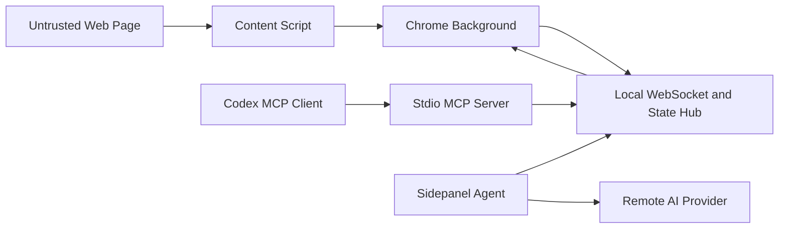

# Chrome DevTools Plugin Threat Model

## 2026-07 execution-core trust-boundary update

The local-only, single-user deployment assumption does not make page content or
Agent output trusted. The daemon now owns memory-only task capability grants.
Each grant is bound to the active extension conversation, Chrome Profile
session, tab/target, normalized HTTP origin, requester principal (`ui` or
`mcp`), stable registered client identity, egress destinations, capability set,
and expiry. The sidepanel is the only surface allowed to create or revoke a
grant. Chat, origin, Profile, provider/destination, or explicit toggle changes
fail closed and revoke or stop matching the grant.

Task grants cover only bounded page observation and ordinary current-page
interaction. Commit-like selectors, password/OTP/token/payment fields, raw
Network rows and bodies, cookies/storage values, cross-origin navigation,
close/delete/publish/send/submit actions, persistent proxy/mock/header rules,
and arbitrary JavaScript remain decision barriers or always-confirm operations.
Executor-side one-shot signed grants, stale-target checks, idempotency conflict
checks, and the prohibition on replaying unknown writes remain unchanged.
Approval freshness is directional: every target identity field known when the
card is created must still match, while a previously missing opaque field may
be filled in for the same target. The daemon performs this check before it
creates a remembered task grant or records approval, and checks the target
again before dispatch.

The action-stage tool accepts only typed native-selector primitives. It cannot
contain JavaScript, stops on failure or an explicit barrier, and uses the same
executor allowlist as primitive tools. DOM delta journals and Network
observation sessions are bounded in memory. Timing telemetry stores numeric
phase durations and byte/character counts only, never raw arguments or page
content.

## Executive summary

The original highest risks combined a high-privilege Chrome extension, an
unauthenticated local WebSocket bus, untrusted page content, and autonomous
model tool execution. The first Architecture V2 implementation slice now adds
bridge-token pairing, optional extension-ID pinning, Chrome Origin validation,
first-frame authentication, server-registered immutable roles,
daemon-enforced one-time approval, untrusted prompt separation,
tool-off gates, Profile session routing, and navigation revisions. Remaining
high risks are remote-provider destination policy, approved raw response-body
egress, complete OOPIF/CDP fidelity, and real-browser regression coverage.

## Scope and assumptions

In scope:

- `public/manifest.json`
- `src/background/**`
- `src/content/**`
- `src/mcp/**`
- `src/shared/**`
- `src/sidepanel/**`
- runtime build and package configuration in `package.json`, `tsconfig.json`, and
  `vite.config.ts`

Out of scope:

- remote or shared daemon hosting
- malicious operating-system administrator
- a malicious process already running as the same OS user with access to Chrome
  profile and daemon configuration files
- supply-chain compromise of Chrome, Node.js, the configured AI provider, or
  installed npm packages
- cloud synchronization and multi-user tenancy

Confirmed context:

- The daemon is local-only and used by one operating-system user.
- Multiple Codex tasks, Chrome windows, and Chrome profiles must work
  concurrently.
- Browser mutations are allowed only after user confirmation.
- The extension may process sensitive application pages, cookies, storage,
  headers, request/response bodies, DOM, screenshots, and chat content.

Open questions that would change risk ranking:

- None for the accepted local deployment model. Exposing the daemon to LAN or
  remote clients would require a new threat model and stronger authentication.

## System model

### Primary components

- **Chrome extension background service worker:** owns Chrome tabs, cookies,
  downloads, DNR, debugger/CDP, WebSocket bridge, and tool dispatch. Evidence:
  `public/manifest.json`, `src/background/index.ts`,
  `src/background/toolDispatcher.ts`.
- **Content script:** reads and changes page DOM, simulates interactions, reads
  storage, and injects temporary/persistent page behavior. Evidence:
  `src/content/index.ts`, `src/content/domInspector.ts`,
  `src/content/browserAutomation.ts`.
- **Sidepanel Agent:** sends prompts to a configurable OpenAI-compatible API,
  parses model tool calls, requests browser/MCP tools, and renders approvals.
  Evidence: `src/sidepanel/App.tsx`,
  `src/sidepanel/services/aiClient.ts`,
  `src/sidepanel/services/autonomousAgent.ts`.
- **Local daemon:** owns the loopback WebSocket listener, authentication,
  approval, Profile routing, browser/session state, and the persisted bounded
  per-Profile AI collaboration workspace. Evidence:
  `src/daemon/server.ts`, `src/daemon/config.ts`, `src/mcp/wsServer.ts`,
  `src/mcp/browserStateHub.ts`.
- **MCP stdio adapter:** connects each Codex task to the existing daemon without
  listening on the daemon port. Evidence: `src/mcp/server.ts`,
  `src/mcp/daemonClient.ts`.
- **Codex MCP client:** launches the stdio process and can invoke all exposed MCP
  tools. It is external to the repository but is the intended MCP consumer.
- **Remote AI provider:** receives user messages, page context, screenshots, and
  tool results through a configurable HTTP endpoint.

### Data flows and trust boundaries

- Web page → Content script: DOM, visible text, attributes, storage, dialogs, and
  events cross from an untrusted origin into extension code. The content script
  applies bounded DOM sanitization in some read paths, but not an authorization
  boundary.
- Content/background → daemon: page state, selected elements,
  screenshots, chat, Agent events, and tool results cross loopback WebSocket.
  Zod validates message shapes; the first frame requires the paired token,
  Chrome clients require a `chrome-extension://` Origin, and the role is
  immutable after hello.
- Codex → MCP stdio process: MCP resource and tool requests enter through stdio.
  MCP arguments use Zod schemas; sensitive and mutating requests pass through
  the daemon approval broker and fail closed without a sidepanel UI.
- Sidepanel → Remote AI provider: prompts, untrusted page context, images, and
  tool results cross HTTPS, or HTTP only for recognized loopback development
  hosts. Authorization headers are added when an API key is configured.
  Structural credential-header redaction, sensitive approval previews,
  value-omission defaults, artifact handling, and keyed Provider-origin change
  confirmation apply before model egress.
- MCP/Agent → Chrome executor: privileged read and mutation commands cross the
  local bridge. The daemon validates policy/approval and signs a request-bound
  execution grant; the background executor validates exact call, Profile,
  Chrome document/navigation, expiry, and replay before dispatch.
- Chrome Network → Agent evidence: recording and request reads use the existing
  reversible-write and sensitive-read approval path. The derived activity
  digest strips query/fragment data, omits headers and bodies, groups repeated
  method/path/status entries, and collapses heartbeat-like traffic before model
  use. Raw approved request rows remain available and therefore sensitive.
- Daemon → Local state/artifacts: sanitized bounded session/audit metadata is
  written atomically with user-only permissions; screenshots and oversized
  payloads use a separate quota/TTL artifact store. Pending requests and grants
  remain memory-only and are not restored after restart.
- Extension AI/MCP AI → CollaborationWorkspace: typed style, DOM, semantic,
  screenshot, network, task, and code handoffs enter a shared Profile session.
  Item source, target, visibility, sensitivity, owner, revision, byte limits,
  and same-Profile broadcast checks are enforced before persistence or model
  context selection. Collaboration content remains untrusted evidence and never
  grants browser permission.
- Codex delegated text → sidepanel task inbox → embedded Agent: delegated text
  remains an unbound Profile-level inbox item until explicit user acceptance.
  Acceptance persists a conversation binding before the text crosses into Agent
  execution input. Only that conversation may project, resume, or complete the
  task. Acceptance creates no browser grant; every resulting sensitive read or
  mutation still traverses the existing policy, approval, freshness, and
  one-time execution-grant boundary. Reloaded or disconnected claimed tasks
  require explicit re-observe-and-resume in the bound conversation.

#### Diagram

## Assets and security objectives

| Asset | Why it matters | Security objective (C/I/A) |
| --- | --- | --- |
| Cookies and storage values | May contain authenticated sessions, tokens, private application state | C/I |
| Authorization headers and network bodies | Can expose credentials, personal data, source code, and business records | C/I |
| Page DOM, text, screenshots, and selected elements | May contain confidential customer or internal data | C/I |
| Browser target and document identity | Wrong routing can mutate or disclose a different page/profile | I/C |
| Chrome privileged capabilities | Debugger, DNR, downloads, tabs, and cookies can alter browser behavior | I/A/C |
| Tool approval decision | Represents the user's intent for a bounded side effect | I |
| Bridge token and local configuration | Grants access to the privileged local broker | C/I |
| Agent run and conversation state | Contains user intent, tool history, and potentially sensitive results | C/I/A |
| AI collaboration workspace | Coordinates selective page/code/task evidence between extension and MCP AIs | C/I/A |
| Daemon and MCP availability | Required for Codex and embedded Agent browser workflows | A |
| Audit events | Needed to explain actions, denials, sensitive egress, and failures | I/A |

## Attacker model

### Capabilities

- Controls content, DOM, text, attributes, frames, network responses, and scripts
  on a page visited by the user.
- Can cause the page to include prompt-injection text intended for the embedded
  Agent or Codex operator.
- Can attempt WebSocket connections to the loopback port from a browser origin,
  subject to Chrome platform network restrictions.
- Can submit malformed, oversized, repeated, or role-spoofed protocol messages if
  a loopback connection is established.
- Can influence output returned by a configured remote AI provider or external
  MCP tool.
- Can cause normal races through navigation, multiple profiles, multiple Codex
  tasks, disconnects, and timeouts without controlling the local OS.

### Non-capabilities

- Cannot read daemon configuration files or Chrome profile storage directly.
- Cannot run arbitrary local processes as the user.
- Cannot change extension source code or npm dependencies.
- Cannot administer the local machine.
- Cannot access a daemon bound only to loopback from a different machine.

## Entry points and attack surfaces

| Surface | How reached | Trust boundary | Notes | Evidence |
| --- | --- | --- | --- | --- |
| Loopback WebSocket | Connect to local port and send JSON frames | Browser/local client → privileged state hub | Requires paired token and protocol v4; Chrome clients also require an extension Origin; daemon assigns an immutable role | `src/mcp/wsServer.ts:startPluginWebSocketServer`, `handleClientHello` |
| MCP stdio tools | Codex invokes an exposed MCP tool | MCP client → browser executor | Capability profile exposes inspect/read/full subsets; policy and approval stay daemon-enforced; arbitrary evaluate is not exposed; dialog handling is a one-current-dialog CDP action | `src/shared/mcpTools.ts:MCP_EXPOSED_TOOL_ORDER`, `src/mcp/toolRuntime.ts` |
| Sidepanel chat input | User sends prompt or image | User → remote model and Agent loop | May include page context and tools | `src/sidepanel/App.tsx:handleSendChat` |
| Profile-local chat history | Sidepanel debounces text and draft updates | User/remote model → Chrome Profile storage | Stores bounded user/assistant text only; omits tools, status, queues, attachment metadata, and image bytes | `src/sidepanel/services/chatWorkspace.ts`, `src/sidepanel/App.tsx` |
| Page context ingestion | Agent automatically reads active page | Web page → model input | Page data is a separately labeled untrusted user message, never a system instruction | `src/sidepanel/services/aiClient.ts:buildSystemPrompt` |
| Model tool output | Formal or pseudo tool call in model response | Remote model → privileged executor | Formal calls pass policy; pseudo-call compatibility is off by default and tools-off is an execution-boundary gate | `src/sidepanel/services/aiClient.ts:parsePseudoToolCalls`, `src/sidepanel/services/autonomousAgent.ts` |
| Content-script message handler | Background sends extension requests | Background → page DOM/storage | Performs bounded DOM/input/storage operations; legacy arbitrary evaluate remains unreachable and persistent dialog override code has been deleted | `src/content/index.ts:handleContentRequest`, `src/background/toolDispatcher.ts` |
| Chrome debugger/DNR/cookies APIs | Tool dispatcher invokes Chrome APIs | Extension → browser-wide capabilities | Broad permissions and all-URL host access | `public/manifest.json`, `src/background/toolDispatcher.ts` |
| Configurable AI endpoint | User saves API URL/key | Sidepanel → remote endpoint | Remote URLs require HTTPS; loopback HTTP is allowed; credentials in URLs and active schemes are rejected | `src/sidepanel/services/aiEndpointPolicy.ts`, `src/sidepanel/services/aiClient.ts:requestChatCompletion` |
| Screenshot/full DOM payload | Tool captures large binary/text data | Browser → WS/MCP/model | Screenshot/oversized results use bounded session artifacts; semantic snapshots are capped and cursor-paginated; explicit full DOM remains sensitive | `src/daemon/artifacts/store.ts`, `src/shared/semanticSnapshot.ts`, `src/content/domInspector.ts` |
| Collaboration publication/resource | Extension AI or MCP AI publishes/reads a typed item | AI participant → Profile state → other AI/model | Same-Profile only; strict kinds/schema, owner and revision controls, redaction, private/sensitive filtering, aggregate limits, relevance selection | `src/shared/collaborationWorkspace.ts`, `src/mcp/collaborationTools.ts`, `src/mcp/browserStateHub.ts`, `src/sidepanel/services/aiClient.ts` |
| Durable collaboration delegation | Codex creates a task; user accepts it in the sidepanel | MCP text → Profile inbox → conversation-bound user decision → embedded Agent input | Stable task ID/fingerprint, Profile/target/conversation binding, explicit claim, immutable result, cancelable wait, no cross-conversation or reload replay; accept is not a browser approval | `src/shared/collaborationTasks.ts`, `src/mcp/collaborationTaskRuntime.ts`, `src/sidepanel/App.tsx`, `src/sidepanel/components/ChatPanel.tsx` |

## Top abuse paths

1. A malicious page embeds instructions in visible text → auto-read places the
   text in the Agent system prompt → model emits an unapproved click/type or
   sensitive-read call → the extension executes it and returns data to the model.
2. A loopback WebSocket client self-declares `plugin` → requests cookie/storage
   or browser tools → global browser routing sends the request to a connected
   extension → raw result returns to the unauthenticated client.
3. A user pins tab A and activates tab B → state hub reports B while executor
   still resolves A → Codex approves an action believing it targets B → mutation
   occurs on A.
4. Navigation replaces document A with B → old selected element/page snapshot
   remains cached → Agent combines old and new state → action targets a stale or
   semantically different element.
5. Model output contains pseudo tool markup while tools are disabled → parser
   reconstructs the call → Agent loop executes it because enablement is not
   checked at the execution boundary.
6. A cookie/network/storage read returns raw credentials → result is serialized
   into chat or Agent session → result is sent to the remote AI provider and/or
   exposed through MCP state resources.
7. A screenshot or network-read operation attaches CDP → cleanup deletes a
   different extension iframe → the page or security extension UI is silently
   modified by a tool classified as read-only.
8. The daemon is not started or exits unexpectedly → stdio adapters cannot reach
   browser state → tasks lose browser capability until the local daemon restarts;
   bounded persisted state survives but active requests do not.
9. A Codex task embeds misleading instructions → the sidepanel treats arrival as
   user approval or silently auto-resumes after reload → embedded Agent performs
   unintended work or repeats a write whose first outcome is unknown.

## Threat model table

| Threat ID | Threat source | Prerequisites | Threat action | Impact | Impacted assets | Existing controls (evidence) | Gaps | Recommended mitigations | Detection ideas | Likelihood | Impact severity | Priority |
| --- | --- | --- | --- | --- | --- | --- | --- | --- | --- | --- | --- | --- |
| TM-001 | Web page or unintended local client | Client can reach loopback WebSocket | Spoof browser/plugin/observer role and invoke tools or read state | Sensitive browser data disclosure and privileged browser actions | Cookies, storage, page data, Chrome capabilities | Loopback binding, Zod parsing, paired token, optional exact extension-ID allowlist, protocol-version negotiation, five-second hello timeout, Chrome Origin validation, fixed client identity-to-role registry, immutable role/connection ID, per-role command allowlist, rate/violation/idle limits, raw-command denial (`src/daemon/config.ts`, `src/shared/wsClientIdentity.ts`, `src/mcp/wsServer.ts`, `src/mcp/wsSchemas.ts`, `src/mcp/protocolPolicy.ts`) | Extension ID pinning is optional by default; same-user processes that possess the token are intentionally inside the local trust boundary; Chrome cannot attest service-worker versus sidepanel context within one paired extension Origin | Pin known extension IDs where desired; protect the user-only daemon config and treat extension subroles as routing controls rather than isolation from a compromised extension | Count failed handshakes, unpaired extension IDs, identity/role/origin violations, idle closes, and command violations without logging tokens | low | high | low to medium |
| TM-002 | Malicious page or remote model output | Auto page context and Agent tools are enabled | Inject instructions or pseudo tool markup that executes despite user/tool policy, exploit a remembered approval outside its intended scope, or use automatic segment continuation to extend malicious execution | Browser mutation, sensitive read, external action, loss of user trust | Browser integrity, approval decision, sensitive data | Page context is an untrusted user message; tools-off is hard-gated; pseudo calls default off; formal/pseudo calls are intersected with the exact advertised tools; strict known-tool parsing precedes approval; conversation-origin approval is memory-only and binds chat, normalized HTTP(S) origin, owning sidepanel instance, Profile session, and Provider destination; destructive, arbitrary, open-world, unknown, unbound, non-HTTP(S), and external MCP requests remain one-time; pending approval has no UI expiry or pre-issued grant; after allow, target/revision and a single-use HMAC grant are revalidated; reaching a run budget creates a separate no-timeout user checkpoint that extends only the exhausted dimension or stops for a tools-off summary and never grants a concrete tool (`src/sidepanel/services/aiClient.ts`, `src/sidepanel/services/autonomousAgent.ts`, `src/sidepanel/agentRunApprovals.ts`, `src/shared/agentRunBudget.ts`, `src/mcp/wsServer.ts`, `src/daemon/executionBroker.ts`, `src/shared/executionGrant.ts`) | Real Chrome budget-card behavior and active-grant chat switching remain manual evidence | Complete browser regression; never treat a budget continuation as tool approval or broaden remembered decisions across chats, origins, Profiles, sidepanel instances, Providers, destructive/open-world tools, or external MCP callers | Audit model-requested, UI-prompted, auto-answered, budget-extended, and executed tools; alert on scope/grant/schema/stale-target mismatches | low | high | medium |
| TM-003 | Normal concurrency or malicious session messages | Multiple profiles/tasks/tabs or crafted session heartbeat/resource URI/cursor | Route state or commands through global active session/latest socket, reuse a resource URI after navigation, switch another adapter's Profile, reuse a collection cursor with another Profile/filter, or make stale cached data look fresh by sending heartbeats | Read or mutate the wrong profile/tab/document; model acts on stale state; cross-Profile audit metadata disclosure | Target identity, page data, audit metadata, browser integrity | Stable Profile installation IDs; per-connection runtime Profile list/select tools restricted to MCP adapter roles; adapter-local heartbeat/state/artifact binding; safe MCP resources require an explicit matching session and opaque tab/frame/document/navigation/revision target key; audit rows are filtered by the bound Profile before filtering/paging; collection cursors bind kind/source/filter/snapshot; matching browser-socket routing; explicit tab/frame/document targets; background-attached page provenance; stale provenance/resource/cursor rejection; navigation invalidation; socket-bound result checks; HMAC execution grants; separate clocks; and protocol/runtime-switch tests (`src/mcp/stateResourceRegistry.ts`, `src/mcp/resourceRouting.ts`, `src/shared/collectionPagination.ts`, `src/mcp/toolRuntime.ts`, `src/mcp/wsServer.ts`) | Tab-close invalidation and all observer broadcasts still need real-Chrome multi-Profile evidence | Complete real-Chrome routing/tab-close/resource/audit regression and keep all state/resource broadcasts session-scoped | Log route selection and stale provenance/resource/cursor/grant rejections using redacted target IDs; alert when liveness is current but state age exceeds policy | low | high | medium |
| TM-004 | Model, MCP client, or page-induced tool request | Sensitive tool is available and returns data | Read raw cookie/storage/header/body/screenshot/full DOM and send it across WS or remote AI | Credential theft, private data disclosure | Cookies, tokens, application data, screenshots | Cookie/storage values default omitted; credential headers use structural redaction; ordinary sensitive reads require approval with egress preview and concrete destination; sending a chat message never captures a page image; optional fast Agent mode defaults off and confirms the displayed Provider origin before first enable and after origin change; the Agent must explicitly call the approval-gated `browser_take_screenshot` tool before visual observation is active; only then may later page-state barriers produce at most 8 adaptive capture attempts and 8 MiB per task, coalesced per tool batch, latest-only, sampled-fingerprint deduplicated, and degraded to fresh DOM without replay; Safe Retry disables the path; tool-produced screenshots and large payloads use session artifacts; persisted Agent/audit state omits raw arguments/results; completed sensitive tool/artifact responses record only class, exact serialized bytes, and authenticated destination (`src/shared/sensitiveData.ts`, `src/shared/agentSession.ts`, `src/shared/egressMetrics.ts`, `src/sidepanel/App.tsx`, `src/sidepanel/services/aiClient.ts`, `src/sidepanel/services/autonomousAgent.ts`, `src/sidepanel/services/fastAgentVisualCheckpoints.ts`, `src/sidepanel/components/AiSettingsDrawer.tsx`, `src/mcp/wsServer.ts`, `src/daemon/artifacts/`) | Fast-mode consent is Profile-persistent rather than chat/origin-scoped, so after one explicitly approved screenshot a user who leaves it enabled can send later page-state checkpoints to the configured Provider without another prompt; the daemon does not meter these direct Provider image requests, and repeated adaptive captures can disclose more of a task than the first explicit screenshot alone; response bodies and explicitly requested cookie/storage values remain intentionally available after approval; the daemon cannot observe how a downstream MCP client or Provider repackages bytes after its authenticated boundary | Keep the active mode visible in context labels, default it off, require confirmation on enable/destination change, preserve the explicit first screenshot approval and the 8-attempt/8-MiB/latest-only boundaries, and tell users to disable it before entering pages they do not want captured; if broader deployments are added, replace persistent consent with chat-and-origin-scoped consent; retain origin-only destination rendering and keep raw values out of logs/state | Metrics for sensitive reads and bytes egressed by class/destination; audit fast-mode enable/disable, Provider-origin changes, explicit screenshot approvals, checkpoint attempts/acceptance/deduplication, and cap exhaustion without image or prompt content | medium | high | medium |
| TM-005 | MCP/Agent tool caller | Caller invokes screenshot, input, network, evaluate, dialog, or another mislabeled tool | Read tool is wired to a mutation executor; selector geometry becomes stale/occluded or child-frame coordinates are sent to the wrong renderer; focus clicks a control before typing; batch form execution changes an early field before a later dynamic failure; select labels resolve ambiguously; evaluate hangs; dialog handling persists | Page breakage, wrong-target interaction, renderer hang, unintended state change | Page integrity and availability | Canonical policy/executor registries and bound grants; selector mouse actions revalidate target and require center hit tests; keyboard targets confirm bounded focus without click and use CDP; form fill performs all-field preflight, element-token/type rechecks, CDP text/toggle input, radio-uncheck denial, bounded field counts, and partial-failure reporting; select is an explicit scoped DOM exception with exact unique option matching, disabled-option denial, token binding, post-event verification, `inputMode: dom`, and no returned field values; Chrome 125+ recursively auto-attaches flat OOPIF sessions and maps CDP/webNavigation trees only on unique parent+URL matches bound to the exact document; ambiguous, same-process, missing, and stale child routes fail closed; dialog handling is one CDP command; arbitrary evaluate is not exposed; invariant tests (`src/shared/mcpExecutionPolicy.ts`, `src/shared/executionGrant.ts`, `src/shared/trustedKeyboard.ts`, `src/shared/formControls.ts`, `src/background/debuggerFrameRouting.ts`, `src/background/debuggerAdapter.ts`, `src/background/toolDispatcher.ts`, `src/background/dialogHandling.ts`) | Same-process child-frame trusted input remains intentionally unsupported; dynamic multi-field pages can partially change after successful preflight if a later post-check fails; real-Chrome OOPIF/form evidence is pending; no isolated evaluator exists, so arbitrary evaluate remains intentionally hidden | Keep unsupported/ambiguous child routes fail closed unless exact same-process coordinate translation is designed; preserve select's non-trusted semantics; complete browser regression; keep legacy evaluate unreachable unless a separately isolated design is approved | Count policy, stale-context/control, focus, route-ambiguity, option-resolution, partial-fill, unsupported-frame/radio/key, and no-dialog rejections; review every new mutation mapping | low | high | low to medium |
| TM-006 | Malicious/large page or protocol client | Client can send or produce large DOM/image/events | Exhaust memory/context/disk or keep Agent/tool loop running | Daemon, extension, renderer, or model-cost denial of service | Availability and cost budget | 8 MiB frame cap; advertised command-specific UTF-8 byte ceilings with a 4 KiB unknown-command default; hello/idle timeouts; per-connection rate limit; pending/active execution caps; Agent cancellation across AI/MCP/browser/standalone search; aligned deadlines; bounded inline MCP output; semantic and Network/conversation/audit cursor pagination; Agent-run-bound SHA-256 idempotency keys; 256,000-character sidepanel tool-result retention with explicit truncation metadata and line virtualization above 240 lines; per-object/session/global artifact budgets; per-Agent duration/model/tool/effectful/sensitive ceilings with atomic batch reservation; and fast-mode visual checkpoints coalesced to one per tool batch, sampled-fingerprint deduplicated, latest-only, and capped at 8 adaptive capture attempts and 8 MiB per task (`src/mcp/wsServer.ts`, `src/mcp/protocolPolicy.ts`, `src/sidepanel/services/webSearch.ts`, `src/sidepanel/agentRunApprovals.ts`, `src/sidepanel/toolResultPresentation.ts`, `src/sidepanel/services/fastAgentVisualCheckpoints.ts`, `src/shared/agentRunBudget.ts`, `src/shared/semanticSnapshot.ts`, `src/shared/collectionPagination.ts`, `src/daemon/executionBroker.ts`, `src/daemon/artifacts/store.ts`) | Limits are statically calibrated; real high-complexity pages may reveal a command or visual-checkpoint budget that is too loose or too strict | Keep fail-closed ceilings and tune only from redacted rejection/size telemetry; do not raise the global frame or visual-checkpoint ceiling to mask one workflow | Monitor connection/message bytes, pending counts, idle closes, cursor rejection, artifact bytes, run duration, visual-checkpoint cap exhaustion, and budget/limit rejections | low | medium | low |
| TM-007 | Normal multi-client use | Local daemon is stopped, crashes, or is not started before adapters | Adapters cannot reach the single local daemon | Browser integration unavailable; active requests are lost | Availability, bounded Agent state | One daemon plus many stdio adapters, atomic bounded state/artifact persistence, status command, separate packaged entrypoints, graceful adapter shutdown on stdio EOF, multi-client/restart tests, and a real-dist two-adapter lifecycle verifier (`src/daemon/server.ts`, `src/daemon/status.ts`, `src/daemon/store/stateStore.ts`, `src/mcp/daemonClient.ts`, `src/mcp/server.ts`, `scripts/verify-packaged-processes.mjs`) | No OS-level packaged supervisor/autostart; active requests and approvals intentionally do not survive restart | Add an optional launchd/system service installer and clear startup diagnostics without coupling daemon lifetime to one adapter | Daemon health, adapter negotiation failures, restart counters | low | medium | low |
| TM-008 | Misconfiguration or malicious endpoint | User or modified persisted config supplies an unsafe provider URL | Send API key, prompts, page context, and results to an unintended endpoint | AI credential and page-data disclosure | API key, page data, chat, screenshots | Settings/fetch-time policy require remote HTTPS and verified loopback HTTP; URL credentials/non-HTTP schemes are rejected; keys migrate to Profile-scoped `chrome.storage.local`; metadata serialization strips keys; Provider-origin changes require explicit confirmation when either an API key or fast-mode screenshot egress is active; sending a message never creates an image; the first Agent-requested screenshot keeps its sensitive-read approval and displays the current Provider origin; only a successful explicit screenshot activates bounded runtime checkpoints to that same origin; embedded-Agent approvals render the current Provider origin only, while MCP approvals identify client-managed downstream egress (`src/sidepanel/services/aiConfig.ts`, `src/sidepanel/services/aiEndpointPolicy.ts`, `src/sidepanel/services/approvalPresentation.ts`, `src/sidepanel/services/aiClient.ts`, `src/sidepanel/components/AiSettingsDrawer.tsx`, `src/sidepanel/components/ChatPanel.tsx`) | Extension storage is not an OS keychain and remains readable by compromised extension code; persistent fast-mode consent does not prompt separately for each later route, drawer, or visual-state checkpoint after the explicit visual chain has started | Keep extension code/CSP narrow, retain origin-only destination rendering on every model-egress approval or persistent-mode confirmation, keep adaptive checkpoints bounded and latest-only, and consider chat/origin-scoped consent or OS keychain integration only if the local threat model expands | Audit Provider origin/TLS policy, fast-mode consent changes, explicit screenshot approvals, checkpoint counters, and migration failures without logging keys, prompts, or screenshots | low | high | medium |
| TM-009 | Compromised extension code or a process already inside the single-user local trust boundary | Access to the current Chrome Profile or extension execution context | Read persisted chat text/drafts or corrupt history and branch metadata | Disclosure of prompts/model responses; misleading restored context | Chat content and conversation integrity | Separate versioned Profile-local key; strict normalization; serialized bounded writes; 20-conversation, 80-message, per-text, and per-conversation caps; tool results, runtime status, queues, attachments, and image bytes omitted; inactive conversations are user-deletable; safe retry creates a fresh conversation and requires confirmation before resending live image attachments (`src/sidepanel/services/chatWorkspace.ts`, `src/sidepanel/chatBranches.ts`, `src/sidepanel/components/ChatPanel.tsx`) | Persisted text is intentionally plaintext in Chrome storage and has no time-based expiry or bulk-delete control; compromised extension code remains able to read it | Keep storage Profile-local and bounded; do not add raw tool/image persistence; add retention duration and clear-all only if the product requires longer-lived history | Report storage failures and normalization drops without logging content; never include stored text in daemon audit logs | low | high | low to medium |
| TM-010 | Malicious page, remote model, or one local AI participant | Collaboration publication, consumption, or delegated-task acceptance is enabled | Publish prompt-injection text, overwrite another AI's state, smuggle secrets into direct MCP context, reuse a task ID for different work, treat arrival/acceptance as browser approval, inject a task into every Chat, resume or finish it from another conversation, auto-resume after reload, flood persisted state, or broadcast evidence across Profiles | Wrong AI action, cross-conversation context contamination, duplicate unknown-state writes, sensitive disclosure, corrupted task takeover, connection denial of service | Collaboration workspace, task and conversation integrity, approval intent, page/code evidence, Profile isolation | Fixed item kinds and strict schemas; actor assigned at authentication; owner/revision checks; redaction and sensitivity filtering; bounded workspace; exact Profile broadcasts; request fingerprint and deterministic task IDs; unaccepted and legacy-unbound recovery tasks remain in a Profile inbox; explicit claim persists a sanitizer-safe conversation binding; UI projection, resume, queued execution, and first terminal publication reject another conversation; unbound terminal tasks are hidden from Chat; target-fresh acceptance; immutable terminal result; bounded cancelable waiters keyed by task ID; arrival never runs the Agent; acceptance creates no execution grant; claimed tasks never auto-resume after reload; explicit recovery prompt requires re-observation before any write (`src/shared/collaborationWorkspace.ts`, `src/shared/collaborationTasks.ts`, `src/mcp/collaborationTaskRuntime.ts`, `src/mcp/collaborationTools.ts`, `src/mcp/wsServer.ts`, `src/sidepanel/App.tsx`, `src/sidepanel/components/ChatPanel.tsx`) | Same-actor client IDs are descriptive rather than a tenant boundary in the accepted single-user model; the conversation key is a routing boundary rather than authentication; a user may explicitly resume while another stale sidepanel is still alive; real-Chrome new-Chat isolation remains | Keep collaboration text untrusted and separate from permission; retain Profile/target/conversation binding and immutable results; never auto-resume or replay unknown-state writes; keep Codex waiters task-ID-bound and Chat-independent; move oversized content to artifacts; add stronger leases only if simultaneous sidepanels become a supported product scenario | Count ID conflicts, duplicate claims, cross-conversation claim/completion rejections, stale targets, waiter capacity/cancellation, recovery attempts, revision/owner/size/schema rejections, and cross-session broadcasts without logging item or conversation content | low | high | medium |
| TM-011 | Remote model or page-induced planning error | The model emits an ordered batch whose later calls assume an earlier mutation succeeded | Deny or fail the first action, then continue later clicks, input, navigation, or external calls against an unverified page state | Wrong-target mutation, unintended workflow progress, repeated approval loops, loss of user trust | Browser integrity, approval intent, task state | General Goal/Observation/Dependency/Barrier/Verification/Re-plan protocol; maximum four calls per model batch; parallel execution restricted to independent safe reads; all effectful, sensitive, open-world, and mixed batches remain ordered; ordered batches stop after the first failed or denied result and synthesize `AGENT_BATCH_DEPENDENCY_SKIPPED` for later calls; success classification treats explicit error, denial, skip, and unmatched results as failures; every actually executed call still receives an independent policy check, approval, idempotency key, target binding, and one-time execution grant (`src/sidepanel/services/agentExecutionStrategy.ts`, `src/sidepanel/services/agentToolBatch.ts`, `src/sidepanel/services/agentToolResult.ts`, `src/sidepanel/App.tsx`, `src/sidepanel/services/autonomousAgent.ts`) | Dependency inference and decision-barrier placement are model-guided; a semantically wrong first action can still execute after user approval; runtime evidence for re-planning after a real Chrome failure is pending | Keep fail-fast enforcement in runtime rather than prompt only; never reuse approval or execution grants across a batch; retain post-mutation read-only verification and no-progress guard; add real-Chrome failed-first-action evidence | Count skipped dependent calls, failed batch position, re-plan attempts, stale-target rejections, and repeated semantic results without logging raw arguments or page data | medium | high | medium |
| TM-012 | Normal WebSocket/daemon failure | A tool request was dispatched but its response is lost during a connection close | Treat a transport failure as successful tool data or automatically replay an operation whose first execution outcome is unknown | Duplicate external/page side effects, misleading Agent state, wasted model rounds | Browser integrity, task state, approval intent, availability | Sidepanel uses typed `MCP_TRANSPORT_CLOSED` failures with bounded close metadata; only a known non-sensitive `safe_read` may reconnect and retry once with its run-scoped idempotency key; sensitive, mutating, open-world, and unknown calls stop without replay; unrecovered transport errors block the Agent and preserve progress instead of creating a tool result; approval uses a separate cancellable in-memory input wait with no active execution slot/grant and creates fresh bounded authorization only after late target validation (`src/sidepanel/services/mcpTransport.ts`, `src/sidepanel/services/mcpBridge.ts`, `src/sidepanel/services/toolRecovery.ts`, `src/sidepanel/App.tsx`, `src/sidepanel/services/autonomousAgent.ts`, `src/daemon/executionBroker.ts`, `src/mcp/wsServer.ts`) | Real disconnect-after-dispatch ambiguous-write evidence is pending; an input wait intentionally ends when its requester/run/socket or daemon disappears and does not survive restart | Add live safe-read reconnect-success and ambiguous-write no-replay tests; preserve fail-closed cancellation and late-context invalidation | Count transport close reasons, safe-read recovery attempts/outcomes, ambiguous effectful stops, and late-context invalidations without logging raw tool data | medium | high | medium |

### Resolved-target decision-barrier invariant

Selector strings are attacker- and model-controlled hints, not authorization
evidence. For selector-based trusted input, the content script projects the
browser-authoritative resolved target's native control type, accessible name,
labels, autocomplete and sensitive-field semantics. The background executor
checks that projection immediately before mutation. An ordinary task grant that
reaches a submit/reset/file control, commit-like element, password, OTP, token
or payment field fails with `DECISION_BARRIER_REQUIRED` before input dispatch.
The caller can request a new approval with `decisionBarrier=true`; the boolean
never authorizes execution by itself. Only a signed single-use grant with
`approvalRequired=true` satisfies the executor. Whole-form preflight performs
this check for every requested field before the first field changes.

## Criticality calibration

### Critical

A realistic page/model input can cause high-impact browser action or sensitive
data disclosure without an effective user decision.

- Page prompt injection causing unconfirmed browser actions.
- Cookie/token/network body exfiltration to a remote model.
- Cross-profile routing that mutates a different authenticated application.

### High

High-impact compromise requires a local connection condition, a specific tool,
or normal concurrency, but existing controls do not reliably contain it.

- Unauthenticated loopback role spoofing.
- Hidden DOM mutation by a read-classified tool.
- Multiple stdio tasks making the browser integration unavailable.

### Medium

Impact is bounded, noisy, recoverable, or requires user misconfiguration.

- Memory/context exhaustion with bounded local recovery.
- API key sent to user-configured non-HTTPS remote endpoint.
- Loss of non-durable cached state without browser data compromise.

### Low

Low-sensitivity disclosure or cosmetic/temporary behavior requiring unlikely
preconditions and having straightforward recovery.

- Disclosure of already-public page metadata.
- A rejected malformed message with no state change.
- Temporary UI status inconsistency without wrong execution.

## Focus paths for security review

| Path | Why it matters | Related Threat IDs |
| --- | --- | --- |
| `public/manifest.json` | Declares broad extension and host permissions | TM-001, TM-004, TM-005 |
| `src/mcp/wsServer.ts` | Network entrypoint, role handling, routing, pending results | TM-001, TM-003, TM-006 |
| `src/mcp/wsSchemas.ts` | Runtime boundary for untrusted WebSocket frames | TM-001, TM-006 |
| `src/mcp/protocolPolicy.ts` | Per-role inbound commands, hello timeout, violation window | TM-001, TM-006 |
| `src/mcp/browserStateHub.ts` | Session identity, retention, stale-state composition | TM-003, TM-004, TM-007 |
| `src/mcp/server.ts` | Couples stdio lifecycle to WebSocket daemon | TM-007 |
| `src/mcp/toolRuntime.ts` | Exposes privileged tools to MCP clients | TM-001, TM-003, TM-004 |
| `src/shared/wsProtocol.ts` | Shared protocol, state payloads, and current sanitization | TM-001, TM-003, TM-004, TM-006 |
| `src/shared/collaborationWorkspace.ts` | Cross-AI provenance, ownership, sensitivity, revision, and persistence bounds | TM-003, TM-004, TM-006, TM-010 |
| `src/shared/agentTaskState.ts` | Durable task phase, verification requirement, and blocker semantics | TM-002, TM-006, TM-010 |
| `src/shared/tools.ts` | Browser capability list, validation, side-effect metadata | TM-002, TM-005 |
| `src/shared/mcpTools.ts` | MCP exposure and AI tool schemas | TM-002, TM-004, TM-006 |
| `src/shared/sanitize.ts` | Regex redaction and URL handling | TM-004, TM-008 |
| `src/shared/sensitiveData.ts` | Structural credential-header and approval-argument redaction | TM-002, TM-004 |
| `src/shared/executionGrant.ts` | HMAC call/target binding, expiry, and replay defense | TM-002, TM-003 |
| `src/shared/reconnectBackoff.ts` | Bounded reconnect behavior under daemon failure | TM-006, TM-007 |
| `src/background/stateHubBridge.ts` | Executes daemon-originated browser calls | TM-001, TM-003 |
| `src/background/toolDispatcher.ts` | Privileged capability dispatch chokepoint | TM-002, TM-004, TM-005 |
| `src/background/chromeApi.ts` | Cookies, tabs, navigation, downloads, target selection | TM-003, TM-004, TM-005 |
| `src/background/debuggerAdapter.ts` | CDP, network bodies/headers, proxy rules, frame cleanup | TM-004, TM-005, TM-006 |
| `src/content/browserAutomation.ts` | Arbitrary evaluate, storage, synthetic input, hidden mutations | TM-002, TM-004, TM-005 |
| `src/content/domInspector.ts` and `src/shared/semanticSnapshot.ts` | Page-data capture, semantic pagination, full DOM, sanitization limits | TM-002, TM-004, TM-006 |
| `src/sidepanel/services/aiClient.ts` | Trust placement, remote endpoint, pseudo tool parsing | TM-002, TM-004, TM-008 |
| `src/sidepanel/services/aiEndpointPolicy.ts` | Remote HTTPS/loopback URL enforcement | TM-008 |
| `src/sidepanel/services/aiConfig.ts` | API-key migration, Profile-scoped credential storage, metadata stripping | TM-004, TM-008 |
| `src/sidepanel/services/approvalPresentation.ts` | Origin-only egress destination labels for Agent, search, and MCP approvals | TM-004, TM-008 |
| `src/sidepanel/components/AiSettingsDrawer.tsx` | Provider-origin and fast screenshot-egress confirmation before persistence | TM-004, TM-008 |
| `src/sidepanel/services/fastAgentVisualCheckpoints.ts` | Agent-activated visual-chain gating, capture cap, exact-image dedupe, and DOM-only fallback | TM-004, TM-006, TM-008 |
| `src/sidepanel/services/autonomousAgent.ts` | Tool loop, budget, cancellation, result reuse | TM-002, TM-006 |
| `src/sidepanel/App.tsx` | Approval policy, sensitive result flow, concurrency | TM-002, TM-004 |
| `src/sidepanel/services/mcpBridge.ts` | Sidepanel-to-daemon command and timeout path | TM-001, TM-003, TM-006 |
| `src/sidepanel/services/mcpTransport.ts` and `src/sidepanel/services/toolRecovery.ts` | Transport failure classification and the only allowed automatic replay boundary | TM-007, TM-012 |
| `src/mcp/collaborationTools.ts` | MCP publication schema and shared-state mutation surface | TM-003, TM-006, TM-010 |

## Quality check

- [x] Covered discovered runtime entry points: WebSocket, MCP stdio, sidepanel AI,
  content messages, Chrome APIs, AI endpoint, DOM/image payloads.
- [x] Covered every primary trust boundary in at least one threat.
- [x] Separated runtime behavior from build/dev/test behavior.
- [x] Reflected confirmed local single-user, multi-instance, and confirmation
  requirements.
- [x] Stated attacker capabilities and non-capabilities.
- [x] Anchored major claims to repository paths and symbols.
- [x] Kept bridge tokens, API keys, cookies, and other secrets out of the report.
