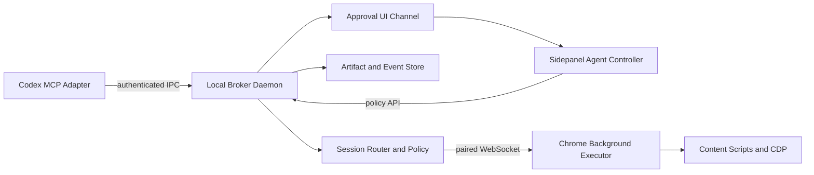
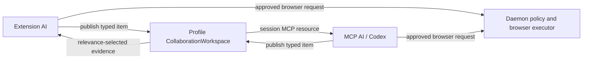

# AI DevTools Assistant Architecture V2

- Status: Accepted; implementation in progress
- Date: 2026-07-10
- Scope: Chrome extension, local daemon, Codex MCP adapter, embedded sidepanel Agent
- Source of truth for implementation order: `docs/implementation-plan.md`

## 1. Confirmed product constraints

The following decisions were confirmed by the product owner and are not assumptions:

1. The service runs only on the local machine for one operating-system user.
2. One daemon must support multiple Codex tasks, Chrome windows, and Chrome profiles concurrently.
3. Read-only page inspection may run without confirmation when it does not expose sensitive values. Every mutation must be confirmed by the user before execution.
4. Cookie values, storage values, authorization headers, request/response bodies, screenshots, and arbitrary JavaScript are sensitive reads even when they do not mutate the page.
5. Chrome pages, tool output, remote model output, and MCP client input are untrusted data. None of them may grant themselves capabilities.

## 2. Current runtime truth

The current implementation has two coupled paths:

```text
Codex stdio MCP
  -> src/mcp/server.ts
  -> in-process WebSocket listener on 127.0.0.1:17321
  -> Chrome background stateHubBridge
  -> toolDispatcher
  -> content script / Chrome APIs / CDP

Sidepanel Agent
  -> remote OpenAI-compatible API
  -> parsed model tool call
  -> sidepanel mcpBridge
  -> the same in-process WebSocket listener
  -> browser executor
```

At the review baseline, state was an in-memory `Map<string, BrowserSession>` and
every stdio MCP process attempted to bind the same port. The daemon/adapter split
is now implemented, so multiple adapters share one listener; browser state is
authoritative in memory while bounded sanitized session/audit metadata and
binary artifacts persist atomically across daemon restart. Active requests,
approval grants, and raw browser payloads intentionally remain memory-only.
Exact completion status remains authoritative in `docs/completion-evidence.md`.

## 3. Problems the V2 design must solve

This list records the review baseline. Items already mitigated in code are
marked; unmarked items remain migration work.

### Security

- [mitigated] WebSocket clients self-declared roles and had no pairing secret.
- [mitigated within the local single-user boundary] Browser state and privileged
  tools share one authenticated local trust bus; role, session, target,
  approval, and execution-grant checks constrain every privileged route.
- [mitigated] Page content was placed in a model system message and could become instructions.
- [mitigated] Tool-off was not an execution-layer deny rule.
- [mitigated] Cookie, storage, network, and screenshot data could leave the
  browser without a structured egress decision.
- [mitigated at daemon boundary] Sidepanel confirmation was not enforced for Codex-originated tool calls.

### Correctness

- [implemented; browser evidence pending] URL/title, selected element, page
  context, screenshot, and tool execution now bind stable
  Profile/tab/frame/document/navigation/revision provenance.
- [mitigated] A manually pinned tab could differ from the tab reported to the state hub.
- [implemented; browser evidence pending] Navigation/document changes
  invalidate document-scoped state, resources, cursors, approvals, and grants.
- [mitigated for bound sessions] Global latest-socket routing did not support multiple profiles or Codex tasks.
- [mitigated] Aligned deadlines and terminal cancellation propagate through
  Agent, adapter, daemon, and browser execution.

### Product and operations

- [mitigated] The embedded Agent uses the long-lived daemon bridge and no longer
  depends on any Codex stdio MCP process lifetime.
- [mitigated] The stdio adapter and the long-lived state service had conflicting lifecycles.
- [mitigated] Screenshot bytes use bounded session artifacts and MCP image
  content instead of JSON/audit base64 duplication.
- [mitigated] Canonical typed registries drive policy, MCP schemas, executor
  mappings, SDK registration, output validation, and approval metadata.
- [mitigated] A strict persisted redacted audit allowlist and separate packaged
  daemon/MCP/status entrypoints exist and have a real-process verifier.

## 4. Design invariants

These invariants are acceptance criteria, not optional guidance:

1. **One daemon, many adapters.** Only the daemon owns the WebSocket port and
   persistent local state. MCP stdio adapters never listen on a port.
2. **Server-issued identity.** A connection cannot choose its authorization
   role or route itself to an arbitrary browser session.
3. **Explicit target identity.** Every browser command is bound to a target and
   expected document revision. A mismatch returns `STALE_CONTEXT` before the
   action reaches Chrome.
4. **Default deny.** Unknown tools, unknown message commands, missing policy
   metadata, and missing approval are rejected.
5. **Confirmation at the privileged boundary.** Model clients may request an
   action, but the daemon and extension executor independently verify the
   approval grant before a mutation.
   No Storage write tool is exposed; Cookie, DNR, CSS, navigation, input, and
   other available mutations remain explicitly policy-classified and approved.
6. **Untrusted context stays data.** Page content and tool output are never
   appended to system instructions.
7. **Sensitive values require an egress decision.** Sanitization is structured
   by data type; regex-only redaction is not an authorization control.
8. **Cancellation is end to end.** Stopping a run cancels queued work and sends a
   cancellation request to the active browser executor.
9. **Bounded resources.** Each connection, session, message type, artifact type,
   and Agent run has byte, count, duration, and concurrency limits. Reaching an
   Agent budget suspends the same task until the user extends only that
   dimension or stops for a tools-off summary; budget continuation never grants
   a concrete tool call.
10. **No hidden page mutation.** A tool classified as read-only cannot remove
    frames, inject persistent handlers, change DOM, or change browser state.
11. **Evidence before completion.** A plan item is complete only when its listed
    verification command or runtime check has passed.

## 5. Target architecture



### 5.1 Local broker daemon

Responsibilities:

- Own the configurable loopback WebSocket listener.
- Generate and load the local bridge secret.
- Authenticate extension instances and MCP adapters.
- Assign immutable connection roles and server-generated connection IDs.
- Route messages by installation, browser session, target, and request.
- Own BrowserStateHub V2, approval broker, artifact metadata, limits, and audit
  events.
- Persist small structured state and artifact metadata in SQLite or an
  equivalent embedded store.
- Store screenshot binaries and oversized payloads as files under the daemon
  data directory rather than in JSON.

The data directory is configurable through `AI_DEVTOOLS_DATA_DIR`. When set,
the daemon resolves `daemon.json`, `state.json`, and `artifacts/` beneath that
single absolute root and enforces user-only directory/file modes. Explicit
`AI_DEVTOOLS_CONFIG_PATH`, `AI_DEVTOOLS_STATE_PATH`, and
`AI_DEVTOOLS_ARTIFACT_DIR` values override their individual child paths. When
the umbrella is unset, the existing `~/.config/...` and `~/.local/share/...`
defaults remain for backward compatibility so an upgrade cannot silently rotate
the bridge token. Tests always use a temporary directory.

### 5.2 Codex stdio MCP adapter

Responsibilities:

- Start per Codex task through stdio.
- Read daemon connection configuration from the local data directory or explicit
  environment variables.
- Connect to the already-running daemon; never bind the browser bridge port.
- Register MCP tools, resources, and prompts.
- Translate MCP calls into daemon requests with a selected browser session and
  target revision.
- Return structured content and image/resource references.
- Treat stdio EOF/closure as adapter shutdown: close the daemon WebSocket and
  heartbeat, close the MCP transport, and exit without affecting the daemon or
  other adapters.

If the daemon is unavailable, the adapter returns an actionable error. It must
not silently launch a second state hub or select an arbitrary Chrome instance.

### 5.3 Chrome background executor

Responsibilities:

- Generate a stable random `installationId` per Chrome profile and store it in
  `chrome.storage.local`.
- Connect to the daemon using the user-provided local bridge secret.
- Publish target lifecycle events and bounded artifacts.
- Execute only commands whose capability, target, revision, deadline, and
  approval grant all validate.
- Keep a per-target serialized mutation queue.
- Treat the daemon as a request broker, not as an implicitly trusted caller.

### 5.4 Sidepanel Agent controller

Responsibilities:

- Keep remote model configuration and the current Agent run state.
- Send page context as a separate untrusted data message.
- Request tools through the same daemon policy path used by Codex.
- Render approval requests with tool provenance, target, affected origin,
  arguments, sensitivity, and reversibility.
- Maintain one active run or an explicit queue; global mutable refs must not
  represent multiple concurrent runs.
- Display connection state separately for daemon state subscription, tool
  execution, and remote AI provider health.

### 5.5 Content and CDP adapters

Responsibilities:

- Content scripts provide DOM, semantic context, element interaction, and
  per-frame identity.
- CDP provides screenshots, trusted input where required, network capture, and
  debugger features.
- Network-relevant intelligent tasks establish recording before the relevant
  action and read once at a later decision barrier. The approval-gated request
  list includes a bounded digest that strips query/fragment data, omits
  headers/bodies, groups repeated method/path/status traffic, collapses
  heartbeat-like GET/HEAD polling, and prioritizes mutations, navigation,
  redirects, and failures for model verification.
- Content and CDP results include target identity and document revision.
- Selector mouse actions split resolution from execution: the selected document
  resolves and scrolls the element, returns bounded geometry/text plus center
  hit-test state, and the background revalidates tab/navigation before emitting
  trusted CDP input. Chrome 125+ flat sessions recursively auto-attach OOPIFs.
  The background correlates the CDP and `webNavigation` frame trees only when
  parent structure and normalized child URL are unique, then binds dispatch to
  the exact extension `frameId + documentId`. Same-process frames, duplicate
  sibling URLs, stale documents, and missing child sessions fail closed.
- Selector keyboard actions use the same target/visibility/hit-test gate, then a
  bounded `element.focus()` operation confirms the active element without
  clicking it. Typing additionally requires an enabled, writable text input,
  textarea, or contenteditable target. Text is inserted with `Input.insertText`;
  individual named or single-character keys use a strict
  `Input.dispatchKeyEvent` map. Unsupported combinations, non-editable targets,
  and slow text over 500 Unicode characters fail closed.
- Batch form filling has a read-only preflight phase for every field. Execution
  rechecks the exact document and per-element token, uses CDP text insertion for
  writable text controls, and uses CDP mouse clicks only when a checkbox/radio
  state must change. A native radio cannot be unchecked directly and fails
  closed. If the page changes after preflight, execution stops and reports that
  earlier fields may already have changed; browser pages cannot provide a
  transactional rollback boundary.
- CDP has no deterministic cross-platform select-option-by-value primitive.
  `browser_select_option` therefore remains a narrowly scoped, approval-gated
  DOM executor: it resolves exact values first, falls back to unique exact
  label/text, rejects missing/ambiguous/disabled options, binds an opaque element
  token, applies the whole selection once, and emits synthetic `input`/`change`
  events. Results explicitly report `inputMode: dom`; no documentation calls
  those events trusted.
- JavaScript dialogs are handled only as current browser state through one
  `Page.handleJavaScriptDialog` command after approval. No tool installs future
  behavior or replaces `window.alert`, `window.confirm`, or `window.prompt`.
- Read tools must not perform cleanup mutations. A debugger conflict is reported
  as an error with remediation, never fixed by deleting page frames.

### 5.6 Collaboration workspace and intelligent task kernel

The daemon owns one versioned `CollaborationWorkspace` per Chrome Profile
session. This is a selective coordination layer, not a full-page dump and not a
task-only store. The embedded extension AI and each MCP AI exchange bounded,
typed items only when another participant needs them.



Supported item kinds are `page.style`, `page.dom`, `page.semantic`,
`page.screenshot`, `network.trace`, `network.mock_scenario`, `task.state`,
`code.finding`, `implementation.note`, and `note`. For example, a CSS question
should publish the selected element's relevant computed styles rather than the
whole DOM; a long browser workflow should publish `task.state`; Codex can answer
with a linked `code.finding` without overwriting extension-owned state.

Every item carries actor provenance, Profile and optional target binding,
visibility, sensitivity, status, item revision, workspace revision, timestamps,
and optional parent linkage. Owners cannot overwrite another actor's item.
MCP updates use optimistic revision checks. The extension's serialized live
task stream may replace its own item without waiting for an acknowledgement so
temporary disconnect queues cannot create false revision conflicts.

Direct MCP access is the session-scoped resource
`ai-devtools://session/{sessionId}/collaboration-workspace`. MCP publishes with
`browser_publish_collaboration_item`. Private items are omitted. Sensitive item
content is withheld from the direct resource; the caller must publish a
redacted handoff or perform a separate approval-gated browser read. The Agent
injects at most eight relevant, active, shared, non-sensitive items into the
untrusted context envelope and respects the user's page-context switch.

The workspace is bounded to 100 items, 32 KiB per inline item, and 256 KiB per
Profile workspace. Oversized content must use an artifact reference. All
workspace broadcasts are restricted to observers authenticated to the same
Profile session.

`task.state` uses `AgentTaskState v1`, but task state is only one item type. Its
controller follows Goal -> Observe -> Plan -> Execute -> Verify -> Re-plan and
persists objective, success criteria, observations, planned/active action,
verification evidence, blockers, phase, and revision. The model is instructed
to build a dependency graph, take the broadest bounded observation that reduces
uncertainty, and place a decision barrier wherever later arguments depend on a
navigation, document replacement, dynamic overlay, unknown selector, or
conditional result. A browser mutation cannot complete until a later read-only
observation verifies the outcome. Budget exhaustion, disabled automatic
continuation, and no-progress detection end as `blocked`, not `completed`, so
either AI can inspect the saved state and continue safely.

The model may emit up to four known-argument tools in one batch. Only safe,
non-open-world reads that require no approval run concurrently; mutations,
sensitive reads, open-world tools, and mixed batches remain ordered and
serialized so parallelism cannot bypass approval or race a page change. An
ordered batch is fail-fast: after a failed or denied call, later calls are not
executed against an unverified state. They receive explicit
`AGENT_BATCH_DEPENDENCY_SKIPPED` results and the Agent must re-plan. Batching is
only scheduling; every executed call retains its own policy check, approval,
idempotency key, exact target binding, and single-use execution grant.

Selector text is not the final risk boundary. Immediately before trusted input,
the extension resolves the actual DOM target and classifies native submit,
reset and file controls, accessible names, labels, autocomplete hints and
sensitive input types. If an ordinary task grant reaches a commit-like or
sensitive target, execution fails before mutation with
`DECISION_BARRIER_REQUIRED`. A retry may set `decisionBarrier=true` to request a
fresh approval card, but that flag is not authorization: execution proceeds
only when the daemon signs a one-time grant whose `approvalRequired` claim is
true. Multi-field form classification completes during whole-form preflight so
no earlier ordinary field is changed before a later sensitive field is found.

Fast Agent mode never captures or attaches a page screenshot merely because the
user sends a message. The initial model request receives only the bounded page
digest and execution map. The Agent must explicitly call the approval-gated
`browser_take_screenshot` tool when visual evidence would materially reduce
uncertainty. A successful screenshot observation activates the bounded adaptive
visual chain for that task; later navigation, visual actions, conditional waits,
uncertain failures, or repeated DOM observations may refresh one latest visual
checkpoint. Before activation, those same barriers refresh DOM context only.

## 6. Identity and state model

### 6.1 Stable identifiers

| Identifier | Created by | Lifetime | Purpose |
| --- | --- | --- | --- |
| `installationId` | Chrome extension | Chrome profile installation | Distinguishes profiles using the same extension ID |
| `connectionId` | Daemon | WebSocket connection | Binds requests and results to an authenticated socket |
| `browserSessionId` | Daemon | Extension connection epoch | Groups state for one connected profile instance |
| `targetId` | Daemon | Open tab target | Stable route key independent of URL text |
| `documentId` | Chrome/daemon | One document | Invalidates data on navigation |
| `revision` | Daemon | Monotonic per target/document | Orders state and detects stale commands |
| `conversationId` | Sidepanel/daemon | User-visible conversation | Separates cleared and historical chats |
| `agentRunId` | Sidepanel/daemon | One Agent execution | Owns cancellation, budget, approvals, and audit |

Each stdio MCP adapter may provide `AI_DEVTOOLS_SESSION_ID` as its initial
Profile binding. It can later call adapter-only `browser_list_sessions` and
`browser_set_session`; the daemon updates only that authenticated WebSocket's
session binding. The selection does not update the daemon's global active
session, another adapter, or any page state. Subsequent heartbeats, state reads,
artifact reads, approvals, and browser calls use the selected session. Unknown
session IDs fail closed and must be refreshed from `browser_list_sessions`.

### 6.2 Target descriptor

Every state artifact and browser command uses a target descriptor:

```ts
interface BrowserTargetRef {
  installationId: string;
  browserSessionId: string;
  targetId: string;
  tabId: number;
  windowId?: number;
  frameId: number;
  documentId: string;
  navigationId: string;
  revision: number;
  url: string;
  origin: string;
}
```

The exact TypeScript shape may evolve during implementation, but the identity
fields and stale-context invariant may not be removed without updating this
decision record.

### 6.3 Invalidation rules

- A new `documentId` clears selected elements, DOM handles, page context,
  screenshots, dialog handlers, and pending mutation approvals for the previous
  document.
- A tab close clears the target and rejects pending commands for that target.
- A reconnect creates a new `browserSessionId`; uncompleted commands from the old
  connection are not replayed.
- Heartbeats update `lastSeenAt` only. Accepted state changes update
  `stateUpdatedAt`; rejected stale updates can advance liveness without making
  cached page data appear fresh. Artifact `capturedAt` remains source-owned and
  is surfaced separately as `artifactCapturedAt`.
- MCP reads include `lastSeenAt`, `stateUpdatedAt`, artifact/page `capturedAt`,
  `revision`, and the exact target. The legacy `updatedAt` output remains only
  as a compatibility alias for `stateUpdatedAt`.

## 7. Protocol V5

### 7.1 Handshake

Client hello:

```ts
interface ClientHelloV5 {
  protocolVersion: 5;
  clientType: "chrome-extension" | "mcp-adapter" | "sidepanel-ui";
  clientName: string;
  installationId?: string;
  bridgeToken: string;
  capabilities: string[];
}
```

Daemon welcome:

```ts
interface ServerWelcomeV5 {
  protocolVersion: 5;
  connectionId: string;
  assignedRole: "browser" | "mcp" | "ui";
  browserSessionId?: string;
  serverCapabilities: string[];
  limits: ProtocolLimits;
}
```

The daemon assigns the role from authenticated client type and connection
origin. A client-supplied `role` is ignored and rejected during migration.

Current implementation note: the wire shape retains the migration-era
`clientRole` field, but requires numeric `protocolVersion: 5` in every hello.
The daemon returns version 5 in `SERVER_WELCOME`, rejects other versions with
`PROTOCOL_VERSION_UNSUPPORTED`, and the browser, UI, observer, and stdio adapter
validate the welcome before treating the socket as authenticated.

V4 added a role-separated durable delegation surface on top of the existing
collaboration workspace. MCP adapters may create and wait for delegated tasks;
the sidepanel may claim and finish them. Internal claim/complete tools are not
advertised to either model, and accepting a task does not create or reuse a
browser execution grant. Unaccepted tasks live in a Profile-level inbox. The
first accept persists a conversation binding in the claim; only that plugin
conversation may project, resume, or complete the task. Codex waiters remain
bound to the durable task ID rather than to the plugin Chat lifecycle.

V5 adds task-scoped capability grants and compact execution observations. A
grant is bound to the exact task/conversation, Profile session, origin, tab,
requester principal/client, and egress destinations. It covers only declared
low-risk capabilities; submit/send/delete actions, sensitive fields, arbitrary
evaluation, rule changes, and open-world egress remain decision barriers.

### 7.2 Message envelope

```ts
interface ProtocolEnvelopeV5<T> {
  protocolVersion: 5;
  requestId: string;
  connectionId: string;
  command: string;
  sentAt: string;
  deadlineAt?: string;
  browserSessionId?: string;
  target?: BrowserTargetRef;
  expectedRevision?: number;
  idempotencyKey?: string;
  approvalGrantId?: string;
  payload: T;
}
```

Rules:

- The first frame must be `CLIENT_HELLO` and has a separate unauthenticated
  schema with a strict byte limit.
- All subsequent frames require the server-issued `connectionId`.
- Each command has a role allowlist and strict Zod schema.
- Results are accepted only from the socket that received the request.
- ACK means the message was validated and accepted for processing. Tool success
  is reported separately.
- Unknown commands close the connection after a bounded number of violations.

### 7.3 Error codes

Stable application errors include:

- `AUTH_REQUIRED`
- `AUTH_INVALID`
- `PROTOCOL_VERSION_UNSUPPORTED`
- `ROLE_FORBIDDEN`
- `SESSION_NOT_FOUND`
- `TARGET_NOT_FOUND`
- `STALE_CONTEXT`
- `APPROVAL_REQUIRED`
- `APPROVAL_DENIED`
- `SENSITIVE_DATA_BLOCKED`
- `REQUEST_CANCELLED`
- `REQUEST_DEADLINE_EXCEEDED`
- `PAYLOAD_TOO_LARGE`
- `RATE_LIMITED`
- `BROWSER_DISCONNECTED`

## 8. Local authentication and pairing

Because the service is local and single-user, the threat model does not require
OAuth or a remote identity provider. It does require protection from arbitrary
web pages and unintended local clients.

Planned controls:

1. The daemon generates a cryptographically random bridge token on first start
   and stores it in a user-readable-only config file.
2. The user copies the token into each Chrome profile once. The extension stores
   it in `chrome.storage.local`.
3. MCP adapters read the token from the local daemon config automatically.
4. Browser-origin connections must have a `chrome-extension://` Origin and a
   valid token. Expected extension IDs can be persisted with
   `daemon:allow-extension` or supplied through
   `AI_DEVTOOLS_ALLOWED_EXTENSION_IDS`; a non-empty list rejects every other
   extension Origin.
5. The daemon binds only to `127.0.0.1` and rejects forwarded host/origin values.
6. Tokens are never written to normal logs, Agent context, MCP resources, or tool
   errors.

`CLIENT_HELLO.clientRole` is not copied into authorization state. The daemon
looks up an exact, build-owned `clientName + transport` identity and returns the
registry's role in `SERVER_WELCOME`; an unknown identity or role mismatch is
rejected. Chrome does not expose whether a WebSocket was opened by a service
worker or sidepanel within the same extension Origin, so browser/UI/observer
subroles are routing controls inside the trusted extension boundary, not an
attestation boundary against a compromised extension. The token plus optional
extension-ID allowlist is the authentication boundary.

Malicious local processes running as the same operating-system user are outside
the primary attacker model because they can generally read the user's browser
profile and daemon config. Accidental and web-origin access remain in scope.

## 9. Tool policy and confirmation

### 9.1 Policy classes

| Class | Examples | Default | Confirmation |
| --- | --- | --- | --- |
| `safe_read` | current URL/title, bounded DOM digest, selected element metadata | allow | no |
| `sensitive_read` | screenshot, cookie values, storage, headers, bodies, full DOM | deny pending approval | every request or explicit bounded grant |
| `reversible_write` | highlight, temporary CSS, resize | deny pending approval | required |
| `page_action` | click, type, fill, select, drag, keyboard, dialog | deny pending approval | required |
| `destructive_write` | navigate, close, cookie mutation, DNR/proxy rule mutation | deny pending approval | required |
| `arbitrary_execution` | evaluate JavaScript | deny pending approval | required; never remembered |
| `open_world` | external MCP tool, web search, download | deny pending approval | required based on provenance and destination |

Unknown tools default to deny. Tool annotations help MCP clients display intent,
but the daemon policy is the security control.

For known MCP tools, strict input validation runs before policy approval. A
malformed call returns an argument error without creating an approval request.
The embedded model parser also intersects formal and compatibility pseudo calls
with the tool names advertised in that exact AI request; stale or invented tool
names are ignored rather than forwarded to approval/execution.

### 9.2 Approval grant

An approval request contains:

- requesting client and Agent run
- canonical tool name and provenance
- policy class and reason
- target origin, tab title, and document revision
- redacted argument preview
- expected side effects and reversibility
- deadline

The UI can deny, approve once, or—only for the embedded sidepanel Agent—remember
eligible decisions for the active chat and normalized page origin. This
conversation-origin permission is memory-only and binds `conversationId`, HTTP(S)
scheme/host/port, authenticated Profile session, owning sidepanel instance, and
AI Provider egress destination. Each automatic decision additionally verifies
that the requester's server-issued connection ID equals that sidepanel's current
authenticated tool connection. It covers `sensitive_read`,
`reversible_write`, and `page_action` across tool names, paths, documents, and
revisions on that origin. It is unavailable to external MCP requesters and never
covers `destructive_write`, `arbitrary_execution`, `open_world`, unknown-policy,
unbound-target, or non-HTTP(S) requests.

The decision is revoked when the user disables its visible switch, changes the
active chat, changes origin, changes Provider, disconnects the browser hub, or
when a later request presents another Profile session. A request owned by
another sidepanel cannot use the decision. A transparent reconnect may replace
the owning panel's connection ID without discarding the user's chat/origin
choice; the replacement connection must authenticate before it can match.
A same-origin path, query, hash, document, or revision update does not revoke the
decision; stale target and revision validation still fail closed independently.
For a pending one-time approval, freshness is checked against the target fields
that were known when the request was created (`url`, tab, window, frame,
document and navigation identity). The browser may safely enrich a previously
missing field, such as publishing `documentId` after the approval card appears;
it may not change any already-bound field. This late check runs before creating
a remembered task grant or recording an approved decision, and the same target
projection is checked again immediately before executor dispatch.

Remembering a UI decision never reuses an execution grant. The daemon still
creates a fresh approval request and, after the scoped UI auto-response, issues
a new single-use grant bound to the
request ID, tool, arguments hash, target revision, browser session, and deadline.
The grant is HMAC-SHA-256 signed with the paired local bridge token and also binds
the requester connection, exact internal browser call, tab/frame/document and
navigation identity. Version 2 grants additionally bind the original MCP tool,
its policy class, and its mutation claim. A complete shared registry maps every
MCP tool to its allowed internal executor(s), while a second complete registry
classifies every internal executor as `none`, `routing`, `page`, `browser`, or
`network`. The daemon validates this boundary before signing; the Chrome
background independently validates it after signature verification and before
dispatch. Unknown mappings and any read-only-to-mutation transition fail closed.
The sidepanel UI is not a browser executor.

No cross-chat, cross-origin, cross-Profile, cross-requester, cross-Provider,
external-MCP, destructive, arbitrary-execution, open-world, or "allow all
mutations forever" option is permitted by this design.

## 10. Untrusted context and sensitive-data egress

- System instructions contain policy only.
- Page context is sent as a separate message labeled `untrusted_page_context`
  with source target, capture time, revision, truncation metadata, and byte count.
- The Chrome background attaches that provenance at the same point where it
  resolves and sends to the selected tab/frame/document. Content scripts cannot
  claim their own Profile or target identity. The Agent envelope reports the
  exact UTF-8 byte count of its serialized payload. A legacy cached snapshot
  without provenance is explicitly `targetKnown: false`.
- Daemon state rejects a provenance-bearing page-context update when its
  tab/frame/document/navigation identity no longer matches the session's current
  target. A late read cannot roll routing state back to an older document.
- Tool results are labeled by source and policy class.
- Cookie and storage results are structured. Names and metadata may be returned
  without values; values require a sensitive-read grant.
- Authorization, Cookie, Set-Cookie, proxy authorization, API keys, and known
  token fields are always structurally redacted before model egress. Approval
  permits the surrounding header metadata or body read; it does not reveal
  credential-header values.
- URL query and fragment parameters both pass through sensitive-key redaction.
- Screenshots are treated as sensitive artifacts and never copied into session
  logs as base64.
- The approval UI shows an egress preview for sensitive reads before sending data
  to a remote AI provider.
- Completed sensitive tool responses are classified without inspecting their raw
  values, and the daemon persists only the exact serialized UTF-8 response byte
  count, class, and authenticated destination (`extension_agent` or
  `mcp_adapter`). Screenshot/payload artifact reads are counted separately at
  the adapter boundary. Raw result content and artifact bytes never enter the
  audit record. These are daemon-boundary metrics; the daemon cannot attest how
  a downstream MCP client or Provider repackages the data on its own wire.
- AI Provider requests enforce HTTPS at both configuration validation and fetch
  execution. Plain HTTP is restricted to recognized loopback hostnames/addresses;
  URL-embedded credentials and active/non-HTTP schemes are rejected.
- AI API keys are kept in `chrome.storage.local` for the current Chrome Profile.
  The profile JSON in `localStorage` contains only non-secret metadata and an
  empty `apiKey`; legacy keys migrate before the legacy copy is removed.
- The sidepanel chat workspace is also Profile-local, but uses a separate
  versioned storage key. It keeps only bounded user/assistant text, timestamps,
  branch provenance, and drafts. Tool results, runtime status, queued messages,
  attachment metadata, and image bytes are excluded. The current limits are 20
  conversations, 80 messages per conversation, 12,000 characters per message
  or draft, and 240,000 stored text characters per conversation.
- When a profile already has a key, changing its Provider origin (scheme, host,
  or port) requires an explicit confirmation before capability detection sends
  any request. Path-only changes within the same origin do not trigger it.

## 11. Artifact and event storage

Target storage layout:

```text
~/.config/ai-devtools-assistant/
  daemon.json                  # bridge token, mode 0600
~/.local/share/ai-devtools-assistant/
  state.json                   # bounded sanitized state and audit, mode 0600
  artifacts/
    index.json                 # metadata only, mode 0600
    objects/                   # screenshot/payload bytes, mode 0600
```

Required behavior:

- The current local-only implementation uses an atomic, serialized JSON state
  file instead of SQLite. It is capped at 8 MiB and stores sanitized sessions,
  targets, revisions, current-conversation metadata, approval decisions, and
  redacted Agent/tool audit summaries. This avoids adding a database runtime for
  a single-user bounded dataset; a future unbounded/queryable event history would
  require migration to SQLite.
- Pending approvals and active requests are never restored after daemon restart;
  only approval/audit events are persisted.
- Binary and oversized data use separate artifact files. The artifact index has
  no base64 or secret values; SHA-256 supports same-session deduplication.
- Artifacts have an unguessable ID, SHA-256, MIME type, byte size, session,
  created time, and expiry time. Local paths never cross the MCP boundary.
- Default retention is bounded and configurable. "New conversation" creates a
  new conversation ID and does not silently expose previous messages.
- Delegated-task requests are Profile-level inbox items until accepted. The
  accepted claim carries a deterministic conversation binding, so terminal and
  recovery cards remain in the original conversation. Legacy unbound terminal
  tasks remain readable by task ID but are not injected into new Chats.
- Sidepanel text history is retained separately in the Chrome Profile rather
  than the daemon state file. The user can switch or delete inactive histories
  from the sidepanel. Safe retry and edit actions always create a new
  conversation ID; restoring a conversation resets and republishes the daemon's
  current-conversation snapshot before appending restored text.
- Screenshot defaults are 24-hour TTL, 8 MiB per object, 50 objects/64 MiB per
  session, and 500 objects/256 MiB globally.
- Logs store references and redacted summaries, not secrets or base64 images.

## 12. MCP contract

- The server name becomes `ai-devtools-mcp-server`.
- Existing tool names remain as migration aliases until the compatibility phase
  is complete.
- Tool registration uses one canonical registry containing Zod input schema,
  output schema, policy class, annotations, description, and executor binding.
- Output schemas are tool-specific rather than a generic open record. The same
  exhaustive Zod catalog drives stdio SDK validation and daemon `tools/list`
  JSON Schema advertising; adapter-only Profile routing tools use a separate
  bounded session-summary contract.
- All tools provide `readOnlyHint`, `destructiveHint`, `idempotentHint`, and
  `openWorldHint`.
- Structured tools return `structuredContent` plus a concise text summary.
- Screenshot tools return MCP image content or an artifact resource link.
- Large DOM/network/conversation/audit collections use cursor pagination or
  artifact handles. Collection cursors bind kind, selected Profile/filter
  source, first-page snapshot length, and a content fingerprint. Append-only
  conversation/audit streams preserve the first-page view; changes within that
  view, truncation, filter changes, and newest-first Network updates fail closed.
- Tool listings are scoped by capability profile so the Agent does not receive
  all tools for every request.
- Stdio adapters select `inspect` (ordinary reads), `read` (ordinary and
  approval-gated sensitive reads), or `full` (all exposed tools). The profile
  limits model-visible tools only and never replaces daemon authorization.
- Safe state resources use session/target-scoped templates. The adapter must
  first select a Profile; target-scoped URIs include an opaque `t1_` key derived
  from the exact tab, frame, document, navigation, revision, and URL. Resource
  reads recalculate that key from the returned state and fail with
  `STALE_CONTEXT` after target change. `resources/list` and template completion
  expose current concrete URIs without page URLs or content in their names.
- Sensitive plugin conversation, screenshot, Agent-session, cookie, storage,
  header, and body data are not exposed as direct static resources. They require
  an approval-gated tool. Artifact resources use unguessable handles produced by
  an approved tool and require an explicitly bound browser session.
- Redacted audit history is likewise tool-only and approval-gated. The daemon
  filters persisted rows by the adapter-bound Profile before caller filters or
  pagination, so another Profile's audit metadata cannot enter the result set.
- Normal stdio-MCP JSON results have a 256 KiB inline budget. Larger results are
  written as session-bound `payload` artifacts and return a concise shape/count
  summary plus resource URI.
- `browser_snapshot` is the primary interactive-page read. It performs a fresh
  read against the adapter-bound browser session and selected
  `tabId + frameId + documentId`, then returns accessibility-oriented nodes with
  stable page-local refs, role/name, selector, state, bounds, exact target, and
  freshness metadata. It does not reuse the daemon's global active session.
- Its returned target prefers the background-captured provenance and reports
  both daemon state revision and browser navigation revision. A mismatch between
  captured provenance and the adapter-bound selected target fails with
  `STALE_CONTEXT`.
- Semantic snapshot pages use a bounded `limit` and an opaque cursor containing
  a fingerprint of the captured semantic collection. A malformed cursor fails
  with `SNAPSHOT_CURSOR_INVALID`; a cursor reused after semantic change fails
  with `STALE_SNAPSHOT_CURSOR` instead of mixing two page versions.
- `browser_get_page_context` remains the compatibility API for bounded visible
  text and legacy DOM summaries; it is not an alias for the semantic contract.

## 13. Capacity and reliability budgets

Phase 4.2 establishes these tested daemon defaults:

- 8 MiB maximum WebSocket frame
- command-specific serialized UTF-8 ceilings: 2 KiB heartbeat; 4 KiB handshake
  and small control messages; 16 KiB active target; 128 KiB selected element;
  256 KiB chat/MCP call; 512 KiB Agent session/browser call; 2 MiB page context;
  and 8 MiB screenshot/browser result. Unknown commands default to 4 KiB.
- 32 simultaneous daemon connections
- 300 inbound messages per minute per connection
- 128 pending browser operations and 64 pending approvals
- 16 active executions per requester connection and 128 globally
- 120-second ceiling for each dispatched execution segment and a 90-second
  browser hop. Human approval waits have no fixed expiry; they remain
  cancellable and do not consume execution capacity.
- one mutation at a time per browser session and target
- five-minute idempotency result retention, capped at 500 entries
- embedded-Agent idempotency keys are SHA-256 digests of the Agent run ID and
  provider tool-call ID. They remain stable for a retry inside one run but
  cannot collide merely because a provider restarts its call index in a later
  reply.
- protocol version 5 negotiation with fail-closed mismatch handling
- capped exponential reconnect backoff with 20% jitter for extension clients
- five-second hello timeout and a per-role inbound-command allowlist
- connection close after three schema/role violations in a one-minute window
- 15-second client heartbeats and 90-second authenticated idle cleanup
- per-Agent-run initial ceilings of 64 model requests, 128 total tool calls, 50
  effectful tool calls, 32 sensitive reads, and 24 hours. Reaching one boundary
  pauses for an explicit user decision to extend only that dimension or
  summarize; it does not silently terminate the task. A model-issued tool batch
  is reserved atomically, so a batch that would cross a ceiling executes none
  of its calls before that decision.
- sidepanel tool-result retention is capped at 256,000 serialized characters per
  displayed result. Results above 240 lines use line virtualization; crossing
  the character ceiling exposes displayed/original counts and pagination/cursor
  guidance instead of silently presenting a partial result as complete.

Transport failures are not browser tool results. The sidepanel preserves a
typed close reason, retries one known bounded `safe_read` at most once after
reconnect, and stops on sensitive, mutating, open-world, or unknown calls. A
write whose connection closes before its response has an ambiguous outcome and
must be followed by a fresh observation; it is never blindly replayed.

Approval now uses a separate bounded-capacity `input_required` pool with no
fixed time expiry. It waits until the user decides or the requester/context is
cancelled, without occupying an execution slot. A late approval creates its
one-shot execution grant only after revalidating the current chat, origin,
Profile, Provider, target and revision. The detailed state model is recorded in
`docs/resilient-approval-browser-control.md`.

The sidepanel keeps the latest 12 tool exchanges exact and mechanically
summarizes older exchanges into a bounded 20,000-character context block. The
configured `maxToolRounds` value is therefore a segment boundary, not the total
Agent-run budget: with automatic continuation enabled (the default), the Agent
uses the bounded context and continues into another segment. Disabling
automatic continuation restores the hard segment stop and one tools-off stage
summary. This is volatile run context, not durable long-term memory; the hard
ceilings above still apply across every segment in the same Agent run.

Model-issued `browser_snapshot` pagination arguments are preserved through the
sidepanel normalizer and remain subject to the MCP runtime's strict cursor and
`1..100` limit schema. Automatic continuation also has a semantic no-progress
guard: when the same read-only tool batch and arguments return the same result
twice after volatile capture timestamps are removed, a third identical batch is
blocked before execution and the Agent is forced into a tools-off summary. This
does not replace the hard run budgets; it stops deterministic read loops much
earlier while still allowing two intentional comparisons.

Daemon construction accepts internal clock and ID factories for deterministic
protocol/approval tests. They are code-level dependencies, not environment or
wire-protocol controls. Production defaults remain the real system clock and
cryptographically generated message IDs.

The daemon returns these transport limits in `SERVER_WELCOME`. Cancellation and
deadlines propagate from MCP/Agent callers to the daemon and browser bridge;
after terminal cancellation, a late browser success cannot resolve the deleted
pending request. Results are accepted only from the browser socket selected for
that request.

The daemon advertises the exact command map in `SERVER_WELCOME`; exceeding a
command budget returns `PAYLOAD_TOO_LARGE` and enters the same bounded protocol
violation window as schema and role violations.

The remaining target budget is:

- optional per-role connection quotas inside the existing 32-connection global
  ceiling, if real multi-Profile load evidence shows one client class can starve
  another

## 14. Migration sequence

1. **Safety baseline in the current topology.** Add hard execution gates,
   secure-default policy metadata, untrusted context separation, target
   invalidation, structured redaction, and remove hidden mutations.
2. **Daemon extraction.** Move WebSocket ownership and BrowserStateHub out of the
   stdio MCP process. Add token config and authenticated daemon client.
3. **Session and approval broker.** Add V2 handshake, immutable routing, target
   revisions, approval grants, cancellation, and audit events.
4. **Artifacts and MCP contract.** Add durable metadata, binary artifacts,
   structured outputs, annotations, capability-scoped tools, and templates.
5. **Browser fidelity and packaging.** Add frame-aware DOM coverage, CDP input
   where required, packaged daemon/MCP entrypoints, setup documentation, and
   end-to-end tests.
6. **AI collaboration kernel.** Add the Profile-scoped typed workspace,
   bidirectional MCP/extension publication, relevance-filtered context, durable
   task state, independent post-mutation verification, and scenario-oriented
   network mock orchestration.

Node packaging emits separate `dist/daemon/server.js` and `dist/mcp/server.js`
entrypoints. A status CLI verifies the authenticated daemon control path without
printing tokens, page URLs, page content, or artifact bytes.

`npm run verify:packaged` exercises those exact `dist` entrypoints with an
isolated private data root and random loopback port. It starts two concurrent
stdio adapter processes, forces both through authenticated daemon tool calls,
closes them independently through stdio EOF, verifies the daemon remains
healthy, then verifies clean daemon shutdown and restart with the same config.

Coordinate and selector mouse tools use CDP `Input.dispatchMouseEvent` rather
than DOM synthetic events. The content script performs bounded geometry,
editability, element-token, and whole-form preflight checks; text, keyboard,
checkbox, and radio execution then uses CDP trusted input. Native select is the
documented approval-gated DOM exception because CDP has no deterministic
cross-platform select-by-value command. Real-browser fidelity remains an
evidence requirement, not an unimplemented synthetic-input fallback.

Compatibility shims must be time-bounded and listed in the implementation plan.
No new feature may depend on the V1 global active-session or latest-socket model.

## 15. Out of scope

- Remote or multi-user daemon hosting
- Shared team accounts or tenant isolation
- Protecting against a malicious process already running as the same OS user
- Autonomous mutation without user confirmation
- Cloud synchronization of browser artifacts
- Persisting raw secrets for future Agent runs

## 16. Completion criteria

Architecture V2 is implemented only when all of the following are proven:

- Two simultaneous Codex stdio adapters can use one daemon without port conflict.
- Two Chrome profile installations remain isolated and commands route to the
  selected profile, tab, frame, and document.
- A stale revision cannot execute a write.
- Every mutation creates and consumes a valid user approval grant.
- Tool-off prevents formal and pseudo tool calls at the execution boundary.
- A webpage cannot obtain browser or observer capabilities by opening the local
  WebSocket.
- Cookie/storage/header/body values do not reach a remote model without explicit
  sensitive-read approval.
- Stopping an Agent cancels its active tool request or returns a confirmed final
  cancellation state.
- Screenshots are returned as image/artifact content, not base64 JSON logs.
- MCP tools expose validated inputs, structured outputs, and correct annotations.
- Extension AI and MCP AI can exchange a Profile-bound style-only handoff and a
  task-state handoff without exposing private/sensitive content or broadcasting
  to another Profile.
- Browser mutations cannot be reported complete without a later successful
  read-only verification; interrupted work remains distinguishable as blocked.
- Unit, integration, build, multi-instance, and browser regression checks pass.
