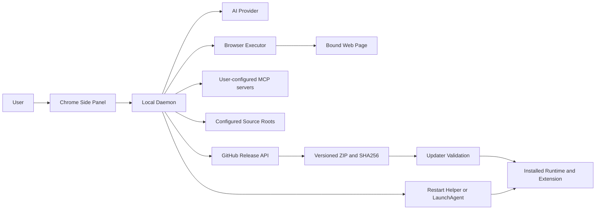

## Executive summary

本次模型覆盖 Release ZIP 自动更新、daemon 托管 Agent、第三方 MCP、浏览器工具执行和
本地源码定位边界。最高风险一是 GitHub 发布账号被控制后，daemon 会安装攻击者发布的
代码；二是用户启用恶意 stdio MCP 后发生本机代码执行；三是 Provider 凭据、页面内容和
浏览器写能力跨过 Side Panel → daemon 边界。当前实现
通过固定发布源与双摘要、严格 WebSocket 角色/Schema、任务与 Tab 绑定、原有工具审批、
内存态凭据和只返回编辑器定位 URI 降低风险；GitHub 发布身份、当前用户权限和本地
Bridge Token 仍是关键信任根。

## Scope and assumptions

- 范围：`src/daemon/localUpdate.ts`、`src/daemon/releaseUpdate.ts`、
  `src/daemon/agentRunner.ts`、`src/mcp/wsServer.ts`、`src/mcp/wsSchemas.ts`、
  `src/mcp/workspaceTools.ts`、`src/daemon/externalMcpRegistry.ts`、
  `src/shared/externalMcp.ts`、`scripts/package-local.mjs`、
  `scripts/bundle-portable-node.mjs`、重启/安装脚本和 `.release-it.json`。
- 假设 Release 发布到公开仓库 `masterjie98-cloud/chrome-devtools-plugin`，普通用户
  不需要 GitHub Token。
- 假设默认流程是自动检查、用户确认后安装，不进行静默无人值守覆盖。
- 假设第三方 MCP 由本机单用户显式导入；导入不执行，只有启用/测试才连接；用户理解
  `npx`/`uvx` 等命令在首次启动时可能自行下载代码。按 server 开启“全部工具自动运行”
  是额外的高风险明示授权，包含读取、写入、删除和未知工具，且对连接到同一 daemon 的
  聊天生效，直到用户在设置中撤销。
- 假设拥有当前用户文件写权限的本地攻击者不在本功能防护范围内；该攻击者原本就能
  修改已解压扩展和 daemon 文件。
- 假设 Side Panel 已安全保存用户配置的 Provider 凭据，并只通过已认证 loopback
  WebSocket 把单次运行所需副本交给 daemon；daemon 不应把凭据写入状态、审计或日志。
- 不在范围：AI Provider 自身、被调试网站自身安全、同一操作系统用户已经能读取扩展
  存储或 daemon 进程内存后的攻击场景。
- 开放问题：若以后面向大规模不受信任用户，是否引入离线 Ed25519 发布密钥；是否
  要求 GitHub immutable release；Windows 是否升级为正式系统服务；是否用平台密钥
  存储替代扩展本地凭据存储。

## System model

### Primary components

- Chrome Side Panel：通过已认证本地 WebSocket 发起检查和用户确认后的更新。
- 本地 daemon：查询 GitHub Release、验证资产、替换安装目录并调度重启。
- daemon Agent Runner：按浏览器 Session 与 conversation 隔离并发模型循环；通过
  既有 MCP 执行管线读取/修改绑定的 Tab，不直接绕过审批。
- 浏览器执行器：Chrome 扩展 background 持有 CDP/DOM/Network 能力，最终执行经过
  task/conversation/Tab 绑定、目标新鲜度和工具策略检查。
- 本地源码定位器：仅在配置的工作区根内匹配 Source Map，返回文件 URI、行列和编辑器
  URI/参数，不启动 shell 或编辑器进程。
- 外部 MCP 注册器：托管用户配置的 stdio/Streamable HTTP Client，隔离工具命名空间，
  限制连接/调用/结果大小。第三方工具默认进入既有 open-world 审批链；只有用户明确
  信任某 server 的声明后，无 destructive 冲突的 `readOnlyHint: true` 工具可免重复审批；
  用户也可对单个 server 明示开启全部工具自动运行，并在设置中撤销。
- GitHub Release：托管正式版本 ZIP、SHA-256 和 GitHub 资产 digest。
- 安装目录：固定的 `runtime`、`extension`、安装元数据与一个上一版本备份。
- 重启辅助进程/LaunchAgent：等待旧 daemon 退出并启动新版本。

### Data flows and trust boundaries

- Side Panel → daemon：更新命令经 `ws://127.0.0.1`，要求 Bridge Token、客户端
  身份和 `ui` 角色；消息大小上限 4 KiB。证据：`src/mcp/wsServer.ts`、
  `src/mcp/protocolPolicy.ts`。
- Side Panel → daemon Agent：单次运行配置、Provider 凭据、历史、页面上下文和图片经
  同一已认证 loopback WebSocket 传输；仅 `ui` 角色可发起，消息上限 8 MiB，Zod 对
  消息数、字符串、工具和附件逐项设界。凭据只存于运行载荷内存，`finally` 主动清空，
  AgentSession 持久化不含 config。证据：`src/mcp/protocolPolicy.ts`、
  `src/mcp/wsSchemas.ts`、`src/daemon/agentRunner.ts`。
- daemon Agent → MCP/浏览器执行器：daemon 为每次工具调用构造受限的合成 `ui`
  requester，继续经过执行 broker、任务目标绑定、审批、审计和浏览器 transport；无可用
  UI 且需要批准时失败关闭，不自动批准。证据：`src/mcp/wsServer.ts`
  `executeDaemonAgentTool`。
- daemon Agent → AI Provider：只允许 Provider URL 策略接受的地址；API Key 作为
  Authorization 类请求凭据使用，不写入 BrowserStateHub、AgentSession 或审计。
  daemon 重启会中止运行，不能在不持久化凭据的前提下自动恢复模型调用。
- daemon → GitHub API：HTTPS 获取 latest formal release，固定 API 主机和仓库；
  只读取 tag、发布页和资产元数据。证据：`src/daemon/releaseUpdate.ts` 中
  `fetchLatestGithubRelease`。
- daemon → Release 资产：只接受固定仓库的精确版本 ZIP/SHA256；重定向结果必须
  仍是 GitHub HTTPS 主机，有下载大小和超时上限。证据：`selectReleaseAssets`、
  `downloadFile`。
- ZIP → 安装目录：先验证摘要、条目和包清单，再在同一安装根内切换目录；失败恢复
  上一版本。证据：`validateArchiveEntries`、`validateExtractedRelease`、
  `replaceInstalledRelease`。
- daemon → 重启辅助进程：辅助程序只允许启动工作目录内部的 server 路径，并等待
  旧 PID 退出。证据：`scripts/restart-daemon.mjs`。
- Source Map → 本地工作区：只允许 adapter 当前目录或
  `AI_DEVTOOLS_WORKSPACE_ROOTS` 中的已配置根；用户/模型可用返回的稳定 root id、唯一
  项目名或已配置根的精确路径选择，其他任意绝对路径会被拒绝。输出是 `file://`、
  `vscode://`、`cursor://` 及显式参数数组，
  不执行命令。证据：`src/mcp/workspaceTools.ts` `resolveSelectedRoot`、`editorTargets`。
- Side Panel → MCP 配置：只有已认证 `ui` 角色可列举、写入、启停、测试或删除；单条
  写入消息 128 KiB，Schema 限制 command/args/env/headers。配置写入 daemon 私有
  `daemon.json`（0600），列表仅回传脱敏 summary。证据：`src/mcp/protocolPolicy.ts`、
  `src/mcp/wsSchemas.ts`、`src/daemon/config.ts`。
- daemon → stdio MCP：`StdioClientTransport` 直接使用 command/args，不构造 shell；仅
  继承 SDK 安全环境变量并合并用户 env。导入不启动，启用/测试才 spawn。该进程仍拥有
  当前 OS 用户权限，因此启用即信任本机代码执行。
- daemon → Streamable HTTP MCP：远端强制 HTTPS，仅 loopback 可用 HTTP；禁止 URL
  内嵌凭据，headers 保存在 daemon 配置。旧 SSE 配置拒绝。
- 外部 MCP tool → Agent：工具名带 server 命名空间；新 chat 默认自动并仅以 `tools/list`
  生成能力欢迎语，也可关闭/指定 server。未知外部工具由 `getToolPolicy` 归类为
  open-world 并默认逐次审批；MCP annotation 是不可信提示，须用户显式信任 server，且
  `readOnlyHint: true` 不得与 destructive hint 冲突。若用户对该 server 明示开启全部工具
  自动运行，读取、写入、删除和未知工具均跳过逐次审批；设置按 server id 隔离、落在 daemon
  私有配置中并可撤销，不扩散到浏览器工具或其他 server。结果上限 1 MiB。
- Side Panel → AI Provider 模型发现：只向由当前 API URL 安全推导的同一 Provider
  `GET /v1/models` 发送当前模型的 API Key；1 MiB 响应上限，只接受 `{data:[{id}]}`，
  Provider origin 改变时在发送已有 Key 前确认。

#### Diagram

## Assets and security objectives

| Asset | Why it matters | Security objective (C/I/A) |
| --- | --- | --- |
| daemon 与扩展代码 | 可控制浏览器调试能力和本地进程 | I/A |
| Bridge Token | 可连接本地 daemon | C/I |
| Release ZIP 与清单 | 更新代码的来源与版本身份 | I/A |
| 安装目录和上一版本 | 决定更新后可运行性与回滚 | I/A |
| GitHub 发布凭据 | 可发布被 daemon 信任的新代码 | C/I |
| AI Provider 凭据 | 可消费用户额度并访问模型上下文 | C/I |
| 页面内容、截图和工具结果 | 可能包含业务或敏感页面数据 | C/I |
| 任务、对话和 Tab 绑定 | 防止 Agent 写到错误页面或跨聊天授权 | I |
| 本地源码与 Source Map | 可泄露项目结构和源码内容 | C/I |
| MCP command、env 与 HTTP headers | 可启动本机代码或携带访问凭据 | C/I |
| 外部 MCP 工具结果 | 可能包含本地文件、远端数据或敏感内容 | C/I |

## Attacker model

### Capabilities

- 远程攻击者可控制网络响应、诱导重定向或提供恶意 ZIP，但不能伪造 GitHub TLS。
- GitHub 仓库或发布凭据被攻破的攻击者可以发布结构完全合法的恶意版本。
- 能获得 Bridge Token 并建立 `ui` 身份的本地进程可触发一次更新检查或安装。
- 被调试页面可控制 DOM、Network、Console、Source Map URL 和部分错误文本，试图向
  Agent 注入指令或诱导其调用高风险工具。
- 用户导入的 MCP 配置或远端 MCP server 可能恶意，尝试执行本机代码、返回提示注入、
  外带工具参数或制造超大/挂起结果。

### Non-capabilities

- 普通被调试网页不能直接发送 `LOCAL_UPDATE`；浏览器执行角色和 MCP 角色均无权限。
- 无当前用户文件写权限的远程攻击者不能直接修改安装目录。
- SHA-256 不能证明发布者身份，只能证明下载内容与受信元数据/sidecar 一致。
- 页面不能直接发送 daemon Agent 命令；`browser`/`mcp`/`observer` 角色不能发起
  `DAEMON_AGENT_START`，也不能直接选择任意本地源码根。

## Entry points and attack surfaces

| Surface | How reached | Trust boundary | Notes | Evidence (repo path / symbol) |
| --- | --- | --- | --- | --- |
| `LOCAL_UPDATE` | 本地 WebSocket | Side Panel → daemon | 仅 `ui` 角色 | `src/mcp/protocolPolicy.ts` `ROLE_COMMANDS` |
| latest Release API | daemon `fetch` | daemon → Internet | 固定仓库、HTTPS、30s 超时 | `src/daemon/releaseUpdate.ts` `fetchLatestGithubRelease` |
| ZIP/SHA 下载 | Release assets | daemon → Internet | 精确名称、大小、主机、2min 超时 | `selectReleaseAssets`, `downloadFile` |
| ZIP 解压 | 系统 tar | 归档 → 文件系统 | 解压前列举并拒绝绝对路径/`..` | `validateArchiveEntries` |
| 目录切换 | daemon 文件操作 | staging → install root | 上一版本备份和失败恢复 | `replaceInstalledRelease` |
| daemon 重启 | detached Node/launchctl | daemon → 新进程 | server 必须位于安装根内 | `scripts/restart-daemon.mjs` |
| `DAEMON_AGENT_START/CANCEL` | 本地 WebSocket | Side Panel → daemon | Bridge Token、`ui` role、8 MiB/4 KiB、严格 Zod | `src/mcp/protocolPolicy.ts`, `src/mcp/wsSchemas.ts` |
| Provider 请求 | daemon Agent | daemon → Internet/内网 Provider | URL 策略、内存态 API Key、Token 预算、终态先落盘 | `src/daemon/agentRunner.ts`, `src/sidepanel/services/aiEndpointPolicy.ts` |
| daemon Agent 工具执行 | 模型 tool call | daemon → MCP/browser | task/Tab 绑定、broker、审批、审计 | `src/mcp/wsServer.ts` `executeDaemonAgentTool` |
| Source Map 根选择 | MCP 参数 | daemon → 本地文件系统 | 配置根白名单、root id、只读扫描 | `src/mcp/workspaceTools.ts` |
| 编辑器定位输出 | Source Map 结果 | daemon → MCP client | URI 与参数数组；不启动进程 | `src/mcp/workspaceTools.ts` `editorTargets` |
| `EXTERNAL_MCP_*` | 本地 WebSocket | Side Panel → daemon config | 仅 `ui` role；写入 128 KiB 上限 | `src/mcp/protocolPolicy.ts`, `src/mcp/wsSchemas.ts` |
| stdio MCP 启动 | 启用/测试配置 | daemon → local process | command/args 直启，不走 shell；当前用户权限 | `src/daemon/externalMcpRegistry.ts` `createTransport` |
| Streamable HTTP MCP | 启用/测试配置 | daemon → network | HTTPS 或 loopback HTTP；无 URL credential | `src/shared/externalMcp.ts` `assertSafeMcpHttpUrl` |
| 外部 MCP tool call | Agent tool call | daemon → MCP server | 命名空间、默认 open-world 审批、显式 server read-only trust、可撤销的 per-server 全工具自动运行、60s/1MiB 上限 | `externalMcpRegistry.ts`, `src/shared/toolPolicy.ts` |
| AI model list | 设置页显式点击 | Side Panel → AI Provider | 同源 URL 推导、HTTPS/loopback、origin 变更确认、GET、1MiB 上限 | `src/sidepanel/services/aiModelCatalog.ts` |

## Top abuse paths

1. 攻击者取得 GitHub 发布权限 → 上传合法命名的恶意 ZIP/SHA → 用户确认更新 →
   本地 daemon 执行攻击者代码。
2. 网络攻击者把资产重定向到非 GitHub 主机 → 主机校验拒绝 → 安装不发生。
3. 恶意 ZIP 使用 `../` 或绝对路径覆盖安装根外文件 → 解压前条目校验拒绝。
4. 超大 ZIP 或无限响应消耗磁盘/内存 → API 大小、流式计数和超时终止下载。
5. 更新过程中第二个请求并发切换目录 → daemon 的单进程 in-flight 锁拒绝第二次更新。
6. 扩展切换完成而 runtime 切换失败 → 事务恢复上一版本目录，避免长期协议错配。
7. 本地攻击者直接调用重启脚本启动任意路径 → server 必须在指定工作目录内。
8. 恶意页面文本诱导模型执行写工具 → daemon 合成 requester 仍进入既有审批、目标绑定
   和决策屏障；没有 UI/授权时调用失败，不在错误 Tab 静默执行。
9. 获得 Bridge Token 的本地进程伪造 daemon Agent 请求并携带外带 Provider 地址 →
   `ui` 身份与 URL 策略仍是控制点；Token 与扩展身份同时泄露仍可能造成凭据/页面外带。
10. 页面 Source Map 声称映射到任意本地路径 → 根选择只接受配置候选，定位器不执行
    编辑器命令，防止把 Source Map 变成本地任意文件/命令入口。
11. 用户导入恶意 stdio MCP → 导入阶段不执行；启用/测试时仍会以当前用户权限启动，UI
    明示风险且工具调用默认逐次审批，但 MCP 进程本身不受浏览器工具审批沙箱保护。若用户
    额外信任 server 的只读声明，恶意 server 可谎报 annotation；若用户开启全部工具自动
    运行，该 server 可在模型选择调用时跳过逐次确认执行任意已暴露能力，因此 UI 明示范围并
    提供按 server 撤销入口。
12. 远端 MCP 诱导把 headers 发到明文/伪造地址 → 非 loopback HTTP、URL 内嵌凭据和旧
    SSE 被拒绝；HTTPS server 仍是用户选择的信任目标。
13. 外部 MCP 返回超大内容或长期不响应 → 连接/调用超时、工具数和结果 1 MiB 上限；
    单个 server 失败不移除其他 server 的工具。

## Threat model table

| Threat ID | Threat source | Prerequisites | Threat action | Impact | Impacted assets | Existing controls (evidence) | Gaps | Recommended mitigations | Detection ideas | Likelihood | Impact severity | Priority |
| --- | --- | --- | --- | --- | --- | --- | --- | --- | --- | --- | --- | --- |
| TM-001 | GitHub 发布账号攻击者 | 获得仓库 Release 权限 | 发布合法结构的恶意更新 | 本机代码执行和浏览器控制 | daemon、扩展、用户数据 | 固定仓库、正式 Release、双 SHA、包清单 | 无独立发布签名 | 增加离线 Ed25519 清单签名和密钥轮换 | 记录 release id、asset id、digest；发布告警 | low | high | high |
| TM-002 | 网络/镜像攻击者 | 能篡改响应或重定向 | 替换 ZIP、SHA 或下载主机 | 恶意代码或破坏安装 | Release ZIP、安装目录 | HTTPS、GitHub 主机、精确路径、digest+sidecar | GitHub 本身仍是共同信任点 | 可选 immutable release 与签名 | 摘要失败和主机拒绝日志 | low | high | medium |
| TM-003 | 恶意归档发布者 | 能控制 Release 资产 | 路径穿越、符号链接或版本混装 | 覆盖任意用户文件 | 安装目录、用户文件 | 解压前路径校验、根目录约束、解压后无 symlink、版本清单 | 依赖系统 tar 的解析一致性 | 增加专用 ZIP 解析器或签名构建流水线 | 记录拒绝条目 | low | high | medium |
| TM-004 | 本地未授权客户端 | 获得 daemon 端口访问 | 触发更新或重启 | 可用性下降 | daemon 可用性 | loopback、Bridge Token、extension identity、`ui` role | Token 泄露后可触发 | 更新操作增加一次 UI nonce/确认记录 | 审计 requester connection id | low | medium | low |
| TM-005 | 意外断电/文件系统错误 | 更新正在切换目录 | 造成半安装状态 | daemon/扩展不可用 | 安装目录 | staging、上一版本、异常回滚 | 进程被强杀时 JS catch 不运行 | 增加启动时安装事务恢复标记 | 启动检查 `.previous` 与事务文件 | medium | medium | medium |
| TM-006 | 恶意或损坏 Release | 可提供超大/超多文件 | 资源耗尽 | daemon 不可用、磁盘耗尽 | 本机资源 | 256 MiB、条目数、路径长度、超时 | 解压后总展开大小未单独计量 | 增加解压后总字节与文件数上限 | 更新耗时/字节指标 | low | medium | low |
| TM-007 | 获得 Bridge Token 与 UI 身份的本地进程 | 能建立已认证 loopback 连接 | 发起 Agent 并把页面数据/API Key 发送到攻击者 Provider | 凭据和页面数据泄露、额度消耗 | Provider 凭据、页面内容 | client identity、role policy、严格 schema、Provider URL policy | 同用户凭据/身份失陷后隔离有限 | 将 Bridge Token 与 extension installation identity 绑定；对 Provider origin 变化强制重新确认；平台密钥存储 | 审计 Agent 发起者、Provider origin 和 egress bytes，绝不记录 Key | low | high | high |
| TM-008 | 恶意页面/提示注入 | Agent 读取攻击者控制的 DOM/Console/Network | 诱导 Agent 调用高风险工具或写错目标 | 页面篡改、数据提交或调试状态改变 | 页面、任务绑定 | untrusted page context 提示、tool policy、审批、task/Tab binding、freshness | 用户完全访问模式扩大自动执行范围 | 对决策/发送/删除/任意 JS 保持不可覆盖的深度审批；继续验证 mutation 后只读证据 | 记录 prompt source、approval mode、target binding 和 mutation audit | medium | high | high |
| TM-009 | 运行时异常或维护者误改 | Agent payload 被错误持久化/打印 | API Key 进入状态、日志或崩溃报告 | 长期凭据泄露 | Provider 凭据 | config 不进入 AgentSession；runner `finally` 清空 apiKey；持久化 schema 只含脱敏会话 | JS 内存无法保证立即擦除；错误堆栈策略需持续审计 | 添加禁止 secret 字段的 state/audit 单测；日志 sink 做键名级脱敏 | secret-field regression test 与日志扫描 | low | high | high |
| TM-010 | 恶意/错误 Source Map | 页面可控制 map 路径与 sources | 读取配置根外源码或触发编辑器命令注入 | 本地源码泄露或命令执行 | 本地源码、主机 | 配置根白名单、稳定 root id、路径 containment、只返回 URI/argv | 编辑器 URI 仍由接收客户端决定是否打开 | 客户端打开前显示根/文件/行确认；保持 argv 数组且禁止 shell 拼接 | 记录 root id、相对路径和匹配置信度 | low | high | medium |
| TM-011 | 非恶意高并发/模型循环 | 多对话同时运行或重复工具调用 | 耗尽 Provider、daemon 内存或浏览器执行队列 | 成本与可用性下降 | Provider 额度、daemon、浏览器 | 每 conversation 单 run、Token/轮次/时长预算、工具批次 fail-fast、消息/附件上限；Stop 经 broker 取消审批、队列和浏览器执行 | 多 conversation 总并发目前没有全局上限 | 增加 session/global 并发和累计 egress/Token 配额 | 并发 run、模型请求、工具次数、耗时与取消指标 | medium | medium | medium |
| TM-012 | 恶意/被篡改 stdio MCP | 用户显式启用或测试配置 | 以当前用户权限读取文件、联网或执行代码 | 本机数据泄露或代码执行 | 用户文件、MCP secrets、daemon | 导入不执行；启用显式；command/args 不走 shell；私有配置 | stdio 进程本身无 OS 沙箱 | 后续支持可选 allowlist、容器/沙箱 profile 和签名 server catalog | 记录 server id、启动状态、退出码，不记录 env | medium | high | high |
| TM-013 | 恶意远端 MCP | 用户启用 HTTPS endpoint | 收集 tool 参数、返回提示注入或敏感结果，或谎报 read-only annotation | 数据外带、Agent 误导 | 工具参数、结果、Provider 上下文 | HTTPS/loopback HTTP；URL 无凭据；外部工具默认 open-world 逐次审批；只读免批须用户逐 server 明确信任且拒绝 destructive 冲突；全工具自动运行须逐 server 明示、持久化并可撤销；chat 可关闭/指定 | TLS 与 annotation 都不能证明 server 业务可信；自动运行授权覆盖该 server 所有工具；headers 静态存储 | UI 展示明确 egress origin；支持 per-server 工具 allowlist | 审计 server id、tool name、trust/auto-run change、egress bytes | medium | high | high |
| TM-014 | 损坏/恶意 MCP server | 能接受连接 | 卡死、工具洪泛或超大结果 | daemon/Agent 可用性下降 | daemon 内存、Provider 上下文 | 20 server、200 tools/server、连接/调用超时、1 MiB 结果上限；单 server 失败隔离 | 子进程 CPU/内存尚无 OS 级配额 | 增加进程资源限制和崩溃退避 | 连接耗时、timeout、result bytes、restart count | medium | medium | medium |

## Criticality calibration

- critical：无需发布权限即可远程静默执行更新代码；跨用户写入系统目录。
- high：发布账号被攻破后执行代码；绕过归档边界覆盖安装根外文件。
- medium：可恢复的半安装、定向资源耗尽、需要 Bridge Token 的可用性攻击。
- low：仅泄露版本/发布页、被大小限制快速拒绝的噪声请求、需本机同用户权限的问题。

## Focus paths for security review

| Path | Why it matters | Related Threat IDs |
| --- | --- | --- |
| `src/daemon/releaseUpdate.ts` | 外部下载、摘要、归档和文件切换的主边界 | TM-001, TM-002, TM-003, TM-005, TM-006 |
| `src/daemon/localUpdate.ts` | 安装模式判断和更新入口 | TM-001, TM-004 |
| `src/mcp/wsServer.ts` | 更新命令授权、并发锁和重启调度 | TM-004, TM-005 |
| `src/mcp/protocolPolicy.ts` | 限定只有 UI 可触发更新 | TM-004 |
| `scripts/package-local.mjs` | 生成被 updater 信任的包清单与资产 | TM-001, TM-003 |
| `scripts/restart-daemon.mjs` | 更新后新进程启动边界 | TM-004, TM-005 |
| `.release-it.json` | 发布资产选择与 GitHub 上传 | TM-001, TM-002 |
| `src/daemon/agentRunner.ts` | Provider 凭据生命周期、并发 Agent 和工具回调边界 | TM-007, TM-008, TM-009, TM-011 |
| `src/mcp/wsSchemas.ts` | Agent 输入、附件和配置的有界验证 | TM-007, TM-009, TM-011 |
| `src/mcp/wsServer.ts` | 合成 requester、审批、任务绑定与事件广播 | TM-007, TM-008, TM-011 |
| `src/mcp/workspaceTools.ts` | Source Map 根白名单与非执行型编辑器定位 | TM-010 |
| `src/shared/externalMcp.ts` | 导入规范化、URL/命令边界与工具命名空间 | TM-012, TM-013 |
| `src/daemon/externalMcpRegistry.ts` | 子进程/HTTP 生命周期、结果边界和路由 | TM-012, TM-013, TM-014 |
| `src/daemon/config.ts` | MCP secrets 的私有持久化和原子写入 | TM-012, TM-013 |
| `scripts/bundle-portable-node.mjs` | 官方 Node 下载、摘要校验和发布包供应链 | TM-001, TM-002, TM-003 |

## Quality check

- [x] 覆盖本地 WS、GitHub API、资产下载、归档、文件切换和重启入口。
- [x] 覆盖 daemon Agent、Provider 凭据、浏览器工具审批和 Source Map 本地文件边界。
- [x] 覆盖第三方 stdio/Streamable HTTP MCP 的导入、启停、凭据、审批与资源边界。
- [x] 每个信任边界至少对应一个威胁。
- [x] 区分运行时 updater、发版工具和测试。
- [x] 明确 GitHub 发布身份和本地同用户攻击者假设。
- [x] 保留离线签名、immutable release、Windows service 和崩溃恢复等开放项。
