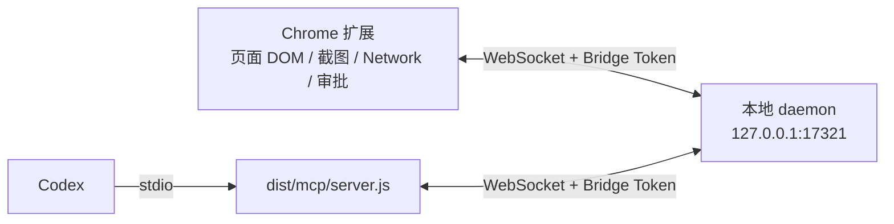

# Codex MCP 接入指南

本项目已经实现 Codex 可用的 MCP server。它不是一个需要填写到 Codex
里的 HTTP URL，而是由 Codex 启动的本地 stdio adapter；adapter 再通过
WebSocket 连接常驻 daemon。



`http://127.0.0.1:8765/index.html` 是普通页面地址，不是本项目的
Streamable HTTP MCP 地址。不要使用 `codex mcp add --url` 接入它。

## 1. 前置条件

- Node.js 20 或更高版本
- Chrome 和 Codex App 或 Codex CLI
- 本项目代码的本地绝对路径
- 每台电脑单独完成扩展与 daemon 配对

不要把自己的 `~/.config/ai-devtools-assistant/daemon.json`、Bridge Token、
浏览器状态或 Codex 配置直接发给别人。接收方应在自己的电脑生成自己的
token。

## 2. 安装并加载扩展

在项目目录执行：

```bash
npm install
npm run build
```

打开 `chrome://extensions`，启用开发者模式，选择“加载已解压的扩展程序”，
加载项目的 `dist/` 目录。

## 3. 启动唯一的 daemon 并配对

只启动一个 daemon，并保持这个终端运行：

```bash
npm run daemon:start
```

另开一个终端打印本机配对 token：

```bash
npm run daemon:token
```

打开扩展侧栏的 AI 设置，把 token 填入“本地 Bridge Token”并保存。不要把
token 粘贴到聊天、日志、截图或共享文档。

如需只允许指定的已解压扩展连接，可从 `chrome://extensions` 复制扩展 ID，
执行下面的命令，然后重启 daemon：

```bash
npm run daemon:allow-extension -- YOUR_EXTENSION_ID
```

## 4. 注册到 Codex

推荐先让项目按当前电脑的真实 Node.js 和仓库路径生成配置：

```bash
npm run client:config
```

默认生成 `smart` 工具面，同时输出 Codex 命令和 Claude Desktop/Cursor JSON。

先取得两个绝对路径：

```bash
command -v node
pwd
```

然后把下面示例中的路径替换成接收方电脑上的真实路径：

```bash
codex mcp add ai-devtools -- \
  /ABSOLUTE/PATH/TO/node \
  /ABSOLUTE/PATH/TO/chrome-devtools-plugin/dist/mcp/server.js
```

macOS 中如果 Codex App 已安装但 shell 找不到 `codex`，可直接使用 App 内的
CLI：

```bash
/Applications/ChatGPT.app/Contents/Resources/codex mcp add ai-devtools -- \
  /ABSOLUTE/PATH/TO/node \
  /ABSOLUTE/PATH/TO/chrome-devtools-plugin/dist/mcp/server.js
```

等价的 `~/.codex/config.toml` 配置如下；优先使用上面的命令生成，避免 TOML
格式和路径转义错误：

```toml
[mcp_servers.ai-devtools]
command = "/ABSOLUTE/PATH/TO/node"
args = ["/ABSOLUTE/PATH/TO/chrome-devtools-plugin/dist/mcp/server.js"]
```

不要在 Codex 配置里写 Bridge Token。adapter 默认从 daemon 使用的私有配置
中读取同一个 token。

## 5. 验证 Codex 配置

```bash
codex mcp get ai-devtools
codex mcp list
```

输出应显示：

- `enabled: true`
- `transport: stdio`
- `command` 指向真实的 Node.js 可执行文件
- `args` 指向项目的 `dist/mcp/server.js`

注册或更新后，新建一个 Codex 任务；如果当前任务仍看不到工具，重启 Codex
App。Codex 的每个任务只启动一个轻量 stdio adapter，不应为每个任务再启动
daemon。

## 6. 在 Codex 中做最小烟测

先保证 Chrome 扩展已连接，然后依次向 Codex 发送：

```text
调用 ai-devtools 的 browser_list_sessions，只返回每个 Profile 的
sessionId、browserConnected、uiConnected 和当前页面标题。
```

存在多个 Profile 时继续发送：

```text
调用 browser_set_session，选择 sessionId 为 <SESSION_ID> 的 Chrome Profile。
```

再做一次只读页面验证：

```text
调用 browser_snapshot 读取当前页面，limit 设为 20；告诉我页面标题和前几个
可交互元素，不要执行写操作。
```

预期结果：

- `browserConnected: true` 表示扩展后台已连接 daemon。
- `uiConnected: true` 表示侧栏已连接，可以显示和处理审批。
- `browser_snapshot` 能返回当前选中 Profile 的页面结构。
- 侧栏常驻三档执行审批：`请求批准`（默认逐次询问）、`替我审批`（仅普通可恢复
  操作自动继续）、`完全访问权限`（仅当前聊天与当前域名内自动继续全部插件能力）。
  MCP 接入服从当前档位，并且每次执行仍使用独立的一次性授权。

### 6.1 推荐的一次调用工作流

新任务优先使用 `browser_workflow`，把观察、最多 20 个有界动作、确定性验证以及
DOM/URL/Network/Console 证据放进一次模型工具调用。普通表单动作仍服从当前任务
授权；提交、发送、删除、敏感字段或模型显式声明的 `decisionBarrier` 仍单独确认。

```json
{
  "observation": {
    "mode": "interactive",
    "frameScope": "auto",
    "fields": ["role", "name", "value", "selectedValues", "checked"]
  },
  "actions": [
    {
      "id": "name",
      "type": "fill",
      "selector": "#name",
      "value": "Ada"
    }
  ],
  "checks": [
    {
      "id": "name-value",
      "type": "target_state",
      "selector": "#name",
      "value": "Ada"
    }
  ],
  "evidence": {
    "dom": true,
    "url": true,
    "network": true,
    "console": true
  }
}
```

观察跨域 iframe 时，`browser_observe` 会为可访问子 frame 返回
`frameRef + documentId + targetRef`。后续动作直接传回这三个值即可路由到该
document，不必先 `browser_set_target_frame`；任一引用过期都会在写入前失败。

元素截图同样可使用上述引用，并支持：

```json
{
  "ref": "sr1_...",
  "frameRef": "fr1_...",
  "documentId": "...",
  "diffAgainst": "previous",
  "returnImage": "changed"
}
```

第二张未变化时只返回 diff 指标，不再传重复图片字节。所有截图仍是显式
approval-gated 读取，不会因发送聊天消息而自动附加。

## 7. Codex 与插件 AI 如何协作

先区分两条链路：

1. **Codex 直接操作浏览器：**Codex 调用 `browser_snapshot`、
   `browser_query_dom`、`browser_take_screenshot`、`browser_network_requests`
   或写操作工具，daemon 把调用转给扩展，扩展完成后通过同一个 MCP tool
   result 直接返回 Codex。这条链路不需要插件 AI 中转。
2. **两个 AI 交换任务和状态：**双方把有类型的协作项写入同一个 Profile 的
   collaboration workspace。它适合任务接力、代码发现、页面样式、Network
   mock 方案和长任务状态，不适合代替一次普通的同步工具结果。

`browser_take_screenshot` 只通过 MCP image content 和 Artifact 返回图片，不会
写入 Chrome Downloads。截图文件的本地保存只能来自用户界面的显式下载操作。
需要检查多个区域或精确视觉样式时，`browser_query_dom` 可以在一次调用中传入
最多 12 个 `queries`，并通过 `computedStyleProperties` 请求受支持的样式字段。

### 7.1 Codex 直接要求扩展获取并返回

这是“Codex 提要求，扩展获取后直接告诉 Codex”的推荐方式。例如：

```text
选择当前已连接的 Chrome Profile。调用 browser_snapshot 获取当前页面结构；
如果需要判断视觉布局，再调用 browser_take_screenshot。把两者的结论直接返回，
不要把完整 DOM 写入协作工作区。
```

调用路径为：

```text
Codex -> stdio adapter -> daemon -> Chrome 扩展 -> daemon -> adapter -> Codex
```

结果属于当前 MCP 调用，不需要另存后再轮询。截图或超大结果可能保存为 daemon
artifact，并在结果里返回受当前 Profile 约束的 artifact URI。

### 7.2 插件 AI 单向把结果交给 Codex

插件 AI 每次运行都会自动把压缩后的 `task.state` 写入 collaboration workspace，
包括执行状态、计划、最近观察、验证证据、阻塞信息和最终结论。Codex 可发送：

```text
调用 browser_list_sessions 并选择当前 Chrome Profile。列出 MCP resources，读取
该 session 的 collaboration-workspace，只总结 source.actor=extension_agent 的
最新 task.state；不要输出无关页面内容。
```

workspace URI 由当前 session 决定，格式为：

```text
ai-devtools://session/{sessionId}/collaboration-workspace
```

不要把别的 Profile 的旧 URI 复用到当前 adapter；应先
`browser_set_session`，再从 `resources/list` 取得本次 URI。

### 7.3 Codex 把问题或任务委托给插件 AI

使用 `browser_delegate_collaboration_task`，不要再用普通 `task.state` 模拟可执行
委托。Codex 应生成稳定且唯一的 `taskId`；格式为
`task_[A-Za-z0-9_-]{8,120}`。示例：

```json
{
  "taskId": "task_login_button_20260716",
  "requestType": "task",
  "title": "检查登录按钮为什么不可点击",
  "instruction": "在当前页面收集 DOM、可见性和遮挡证据，解释根因；不要修改页面。",
  "acceptanceCriteria": [
    "返回目标元素的稳定定位信息",
    "给出可见性或遮挡证据",
    "明确说明结论是否已验证"
  ],
  "scope": "target",
  "sensitivity": "page_content"
}
```

daemon 会把它保存为 `task.request` 并广播给对应 Profile。未接受的任务只进入
Profile 级 `Codex 收件箱`，不会被投影进每一个 Chat。用户在收件箱点击
“接受并运行”后，daemon 才把 claim 绑定到当时的插件 `conversationId`，对应
`Codex · MCP` 卡片进入该对话：

- 到达和显示不等于执行；未点击“接受并运行”前，插件 AI 不会收到该任务。
- 未接受任务可跨对话在收件箱中处理；接受后不能移动到其他对话，也不能在其他
  对话中恢复或写入终态结果。
- 新建或切换对话不会显示其他对话已接受、完成、失败或取消的 Codex 卡片；回到
  原对话仍可看到该卡片及结果。
- 接受只把委托文字作为插件 Agent 输入，不授予任何浏览器权限。
- 每个敏感读取、页面写操作和外部操作仍走原有审批、目标新鲜度与一次性执行
  grant。
- `requestType: "question"` 适合只要求插件 AI 分析或回答；`"task"` 适合需要
  工具执行和验证的工作。

同一 `taskId` 与完全相同的请求可安全重试并返回已有任务；同一 ID 携带不同请求
会返回 `IDEMPOTENCY_CONFLICT`，防止重复任务串线。

### 7.4 Codex 等待插件结果

创建委托后，Codex 应立即调用：

```json
{
  "taskId": "task_login_button_20260716"
}
```

工具名为 `browser_wait_for_collaboration_result`。调用在 daemon 中没有业务超时，
可一直等待用户处理；Codex 取消调用或 adapter 断线只会取消当前 waiter，不会
取消、重启或重放插件任务。插件完成后，持久化的 `task.result` 会直接成为该 MCP
调用的返回值。

如果 Codex/adapter 断线，恢复后用同一 `taskId` 再调用 wait：已有终态结果会
立即返回。无需轮询整个 workspace，也无需用户再发送“插件已完成”。

### 7.5 中断恢复与写操作未知状态

插件侧栏关闭、重载或连接中断时，已 claim 但没有终态结果的任务保持为
`claimed`。重新打开后显示“重新检查并恢复”，不会自动继续：

1. 用户显式点击恢复。
2. Agent 先重新读取 DOM、路由和必要的 Network 状态。
3. 上一次点击、输入、提交、Mock 等写操作如果结果未知，不得仅因结果丢失而
   重放；只能根据新证据决定下一步。
4. 完成、失败、取消和拒绝都会产生一个不可覆盖的终态结果。

升级前已经 claim、但没有 `conversationId` 绑定的旧任务会重新进入全局收件箱。
用户必须在目标对话中显式恢复，daemon 才补上绑定；旧的未绑定终态任务不会投影
到任意新对话，但 Codex 仍可用原 `taskId` 读取其持久化结果。

### 7.6 普通共享上下文仍使用 publish/resource

`browser_publish_collaboration_item` 仍用于页面样式、代码发现、Network mock
方案、实现说明等“给另一个 AI 参考”的上下文；它不会创建待执行任务，也不会
出现接受按钮。需要插件 AI 明确接管的工作应使用 delegate/wait 组合。

### 7.7 保存位置与数据边界

默认保存位置：

- daemon 配置和 Bridge Token：
  `~/.config/ai-devtools-assistant/daemon.json`
- collaboration workspace、插件会话摘要和审计状态：
  `~/.local/share/ai-devtools-assistant/state.json`
- 截图和超大二进制 artifact：
  `~/.local/share/ai-devtools-assistant/artifacts/`

这些目录只用于本机当前 OS 用户，不应同步或发送给别人。协作工作区按 Chrome
Profile session 隔离，最多保留 100 个 item；单个 item 的 JSON content 上限为
32 KiB，整个 workspace 上限为 256 KiB。完整 DOM、截图二进制、凭据和敏感
Network body 不应直接塞进协作项。

### 7.8 通知边界

workspace 更新不会凭空创建一个新的 Codex 对话轮次。可靠的双向流程要求 Codex
在创建委托后保持 `browser_wait_for_collaboration_result` 调用，或在恢复后用同一
task ID 再次等待。这样插件的异步终态会转成当前 Codex 任务可消费的 MCP result，
而不是依赖模型主动轮询或用户口头转述。

## 8. 可选配置

### 固定 Chrome Profile

通常建议运行时调用 `browser_list_sessions` 和 `browser_set_session`。如果某个
Codex MCP 配置必须固定到一个 Profile，可重新注册并加入环境变量：

```bash
codex mcp remove ai-devtools
codex mcp add \
  --env AI_DEVTOOLS_SESSION_ID=YOUR_PROFILE_INSTALLATION_ID \
  ai-devtools -- \
  /ABSOLUTE/PATH/TO/node \
  /ABSOLUTE/PATH/TO/chrome-devtools-plugin/dist/mcp/server.js
```

### 限制工具范围

`AI_DEVTOOLS_MCP_TOOL_PROFILE` 支持：

- `smart`：默认；10 个面向任务的核心浏览器工具
- `inspect`：只暴露安全只读工具
- `read`：暴露安全只读和敏感只读工具；敏感读取仍受审批策略约束
- `full`：暴露完整专家工具集

例如只接入安全只读工具：

```bash
codex mcp remove ai-devtools
codex mcp add \
  --env AI_DEVTOOLS_MCP_TOOL_PROFILE=inspect \
  ai-devtools -- \
  /ABSOLUTE/PATH/TO/node \
  /ABSOLUTE/PATH/TO/chrome-devtools-plugin/dist/mcp/server.js
```

## 9. 更新与排障

### 更新代码后

```bash
npm install
npm run build
npm run daemon:install-service
```

随后重新加载 Chrome 扩展，并新建 Codex 任务。新协议通过 `buildId` 和
`schemaHash` 同时校验 adapter、daemon 与扩展；任一端仍是旧构建时会拒绝连接并
提示应重启的组件，而不是等到业务工具调用时报未知参数。若只更新了代码、项目和
Node.js 的绝对路径都没变，不需要重复 `codex mcp add`。

对本机 8765/8766 fixture 做完整工作流回归：

```bash
npm run verify:workflow-evidence -- \
  --tab-url-prefix http://127.0.0.1:8765/
```

### 常见问题

- **Codex 中没有 ai-devtools：**运行 `codex mcp get ai-devtools`；注册后新建
  Codex 任务或重启 App。
- **`browserConnected: false`：**确认 daemon 在运行，扩展已加载，Bridge Token
  已保存，并检查扩展 ID allowlist。
- **`uiConnected: false`：**打开扩展侧栏。需要人工审批的操作在侧栏未连接时
  无法完成。
- **`MCP tool connection closed before a result was returned`：**检查 daemon 是否
  仍监听 `127.0.0.1:17321`，再新建 Codex 任务。
- **`PROTOCOL_VERSION_UNSUPPORTED`：**代码、`dist/`、正在运行的 daemon、Chrome
  扩展和 Codex adapter 不是同一次构建；重新执行 `npm run build` 并全部重启。
- **`BUILD_ID_MISMATCH` / `SCHEMA_HASH_MISMATCH`：**至少一端仍是旧构建；按报错
  指引重启 Codex 任务、daemon 或重新加载扩展。
- **`STALE_CONTEXT`：**页面在读取或审批后发生了导航或 DOM 修订；重新读取页面，
  不要重放旧审批对应的写操作。
- **Debugger 冲突：**另一个扩展或 DevTools/CDP 客户端占用了 Chrome debugger；
  先释放冲突的调试会话再重试。
- **路径改变：**执行 `codex mcp remove ai-devtools`，再用新的绝对路径重新添加。

移除接入不会删除 daemon 配置、扩展数据或项目文件：

```bash
codex mcp remove ai-devtools
```

## 10. 给接收方的最短说明

可以直接把下面这段与本仓库地址一起发给接收方：

> 安装 Node.js 20+，克隆项目后执行 `npm install && npm run build`，把 `dist/`
> 加载为 Chrome 已解压扩展。运行 `npm run daemon:start`，再运行
> `npm run daemon:token`，把本机生成的 token 保存到扩展 AI 设置。最后执行
> `codex mcp add ai-devtools -- <node绝对路径> <仓库绝对路径>/dist/mcp/server.js`，
> 新建 Codex 任务并调用 `browser_list_sessions` 验证。不要复制或分享别人的
> token、`daemon.json` 或 Codex 绝对路径配置。
