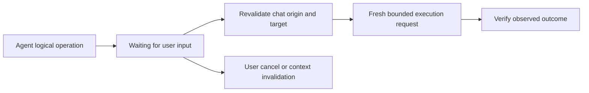

# Resilient approval and browser control

- Status: accepted design; transport recovery phase in implementation
- Date: 2026-07-15
- Scope: embedded sidepanel Agent, local daemon protocol, browser executor, MCP adapter
- Deployment: one local OS user; one daemon, multiple Chrome Profiles and AI clients

## 1. Confirmed problem

The result below is not produced by `browser_query_dom`:

```json
{
  "error": "MCP tool connection closed before a result was returned."
}
```

It is created by `src/sidepanel/services/mcpBridge.ts` when its WebSocket closes.
`src/sidepanel/App.tsx` catches that transport exception and serializes it as an
ordinary tool result. This makes an infrastructure failure look like a completed
browser observation and lets the Agent spend another model/tool round on data
that never came from the page.

There are currently three separate time boundaries:

1. an approval request is capped at 30 seconds in `src/mcp/wsServer.ts`;
2. a sidepanel MCP call defaults to a 120-second deadline;
3. the daemon execution broker enforces a maximum 120-second request deadline.

The WebSocket heartbeat is 15 seconds and the authenticated idle close is 90
seconds. A healthy sidepanel connection should therefore not be closed merely
because the user has not clicked the approval card for 30 seconds. Approval
expiry cancels the request; a `MCP tool connection closed...` result instead
means that the sidepanel-to-daemon connection itself closed or failed.

## 2. Product decision: durable intent, bounded execution

The approval UI may wait for the user without an arbitrary short countdown, but
an MCP/browser execution request must not remain alive forever.

An indefinitely live execution request would retain broker capacity, abort
listeners, target revision, approval recipients, and a potentially stale action.
It also makes a reconnect ambiguous: a write may have executed even though its
result was lost. The MCP lifecycle recommends request timeouts and cancellation,
and always retaining a maximum timeout even when progress is reported.

The replacement is a two-level state machine:



`Waiting for user input` is a memory-only logical task. It does not hold a
browser execution slot or a signed grant. The card remains until one of these
terminal events occurs:

- the user allows or rejects it;
- the user cancels the Agent run;
- the conversation, Profile, Provider destination, or page origin changes;
- the originating sidepanel run is replaced;
- the daemon or extension is explicitly stopped.

After a late allow decision, the daemon must re-read the current target and
revision and create a fresh one-time execution grant. If the target meaningfully
changed, the old card cannot authorize the new target; the Agent receives a
context-invalidated result and must observe and plan again.

This design gives the user a durable decision surface without treating stale
browser state as permanently authorized.

## 3. Transport recovery contract

Transport failures are operational state, not browser tool output.

| Call class | On connection loss | Automatic behavior |
| --- | --- | --- |
| Known bounded `safe_read` | No browser mutation or sensitive egress | reconnect and retry once with the same idempotency key |
| Sensitive read | May duplicate approved data egress | stop; require a fresh decision/retry |
| Any mutation or open-world call | The action may have executed before its result was lost | stop with ambiguous outcome; observe current state before any retry |
| Unknown tool | Effects are not provable | stop; never replay automatically |

The UI must render a connection/recovery status, not a green completed tool card.
If the safe-read retry also fails, the Agent becomes blocked and preserves its
current progress. The next user continuation can reconnect and resume from a
fresh observation.

## 4. What Codex-style Chrome control exposes

The inspected Codex Chrome surface combines three complementary paths:

- locator actions derived from a fresh DOM snapshot;
- visible-DOM node IDs that can be clicked directly;
- coordinate computer-use actions for mouse move, click, double click, drag,
  wheel, keypress, and typing, plus screenshots for visual verification.

Its operating discipline is as important as the individual calls: observe,
resolve one unambiguous target, act, and then collect the cheapest fresh state
needed for the next decision. Coordinate control is a fallback when semantic or
locator control cannot express the target.

The internal implementation of Codex Chrome is not part of this repository, so
only the exposed behavior above is treated as verified. Its private routing and
recovery internals are not assumed.

## 5. Current project capability and actual gap

This project already dispatches trusted Chrome DevTools Protocol input:

- `browser_mouse_move_xy`, `browser_mouse_click_xy`, `browser_mouse_down`,
  `browser_mouse_up`, `browser_mouse_drag_xy`, and `browser_mouse_wheel_xy`;
- selector-based click, hover, drag, type, keypress, select, and batched form
  fill;
- `Input.dispatchMouseEvent`, `Input.dispatchKeyEvent`, and `Input.insertText`;
- semantic snapshots with role, accessible name, selector, bounds, and a
  page-local `ref`.

The missing product layer is that snapshot `ref` values are descriptive only.
Action tools still require the model to copy or invent a CSS selector, or fall
back to raw coordinates. This increases stale/ambiguous-selector failures and
encourages repeated query/click loops.

## 6. Target browser-control contract

### Phase A — resilient transport

- preserve WebSocket close code/reason as a typed transport error;
- retry one known `safe_read` after reconnect;
- never convert a transport failure into ordinary tool data;
- never blindly replay a write with an unknown outcome;
- expose connection recovery as Agent status.

### Phase B — durable input-required approval

- introduce a logical operation ID separate from each bounded execution request;
- persist only bounded, redacted, memory-only approval intent metadata;
- allow the approval card to remain without a 30-second UI expiry;
- cancel on explicit user/run/context invalidation;
- revalidate target and issue a fresh grant only after the decision;
- bound pending intents per conversation and deduplicate identical requests.

Implemented on 2026-07-15 for the current in-memory request lifecycle. Approval
now waits in `ExecutionBroker.waitForInput`, which is cancellable but does not
reserve an active execution slot, start the execution deadline, or issue a
grant. The browser target/revision is checked again after an allow decision;
only then does the daemon create a fresh bounded execution request and signed
grant. The wait ends on an explicit allow/deny, Agent Stop/caller abort,
requester or daemon disconnect, or failed late-context validation. It does not
survive an extension or daemon restart.

If the installed MCP SDK and negotiated client support MCP Tasks, the stdio
adapter may map this state to `input_required`. The internal sidepanel protocol
must not depend on that experimental capability; it uses the same state model
with its existing WebSocket messages.

### Phase C — actionable semantic references

- bind each snapshot `ref` to Profile, tab, frame, document, navigation,
  revision, snapshot fingerprint, and a bounded resolver token;
- let click/hover/type/press/select/drag accept `ref` as an alternative to a
  selector;
- resolve the ref immediately before action and re-run visibility, hit-test,
  editability, and target checks;
- reject stale refs with one actionable `STALE_SNAPSHOT_REF` result;
- keep coordinate tools as an explicit fallback, with viewport bounds checks.

### Phase D — observation and verification loop

- prefer one broad bounded snapshot over repeated selector queries;
- batch only actions whose targets and arguments are already known;
- split at navigation, dynamic overlays, or conditional UI barriers;
- require a fresh narrow observation after mutations;
- record transport recovery, stale-ref rejection, ambiguous outcome, and final
  verification in the Agent task state without storing raw values.

## 7. Acceptance tests

1. Close the sidepanel-daemon WebSocket during `browser_query_dom`; the safe read
   reconnects and runs at most once more, and no connection-error tool card is
   appended.
2. Close it after dispatching a click but before returning its result; the Agent
   stops with an ambiguous-outcome message and does not click again.
3. Leave an approval card untouched beyond 30 seconds; the logical task/card
   remains, while no broker execution slot or grant remains reserved.
4. Approve after the page origin or conversation changes; the old intent is
   invalidated and cannot execute.
5. Use one semantic snapshot ref to click/type; a same-document ref succeeds,
   and a post-navigation ref fails before input dispatch.
6. Coordinate mouse fallback operates on the selected viewport and reports a
   bounded result; it never bypasses normal approval.

## 8. Explicit non-goals

- no permanent approval grant;
- no unbounded active MCP, WebSocket, or browser-executor request;
- no automatic replay of writes after an ambiguous disconnect;
- no dependence on private Codex browser internals;
- no arbitrary page JavaScript as the default control path.

## 9. 2026-07-15 transport validation and protocol-drift repair

Live daemon output exposed a separate cause of the recurring disconnects. The
sidepanel passed a full `PageSnapshotTarget` into `COLLABORATION_ITEM_UPSERT`.
That object carries page-only `title` metadata, while the strict collaboration
binding intentionally accepts only routing fields. Each Agent session update
therefore counted as a schema violation; the protocol closed the UI socket at
its three-violation threshold.

The sidepanel WebSocket boundary now projects targets through
`toCollaborationTargetBinding` before publication. The receiver remains strict:
projected routing fields are accepted, while an unprojected page target with
`title` is rejected. This fixes schema drift without broadening the daemon's
accepted input.

Evidence for the repaired code state:

- collaboration and protocol regressions passed, including positive projected
  target and negative unprojected target cases;
- the full suite passed 238/238 and TypeScript `--noEmit` passed;
- extension, content-script, daemon, MCP-adapter, and status builds passed;
- packaged daemon restart and two concurrent adapter verification passed;
- after reloading the real extension, three consecutive real
  `browser_query_dom` calls returned complete results and the sidepanel stayed
  connected beyond the former protocol-close threshold;
- an unrelated model-generated click request was cancelled from the sidepanel,
  and the fixture remained unchanged.

## 10. 2026-07-15 durable approval validation

- `ExecutionBroker` coverage verifies that an input wait is cancellable while
  active execution capacity remains available.
- daemon-adapter coverage verifies that the approval carries no UI expiry,
  remains pending past the former timeout, and completes only after an explicit
  decision.
- the full automated suite passes 240/240; TypeScript and all five production
  build targets pass.
- in the reloaded Chrome sidepanel, a real `browser_click` approval card was
  still present after 52 seconds. Explicit rejection removed the card, stopped
  the Agent, and left the fixture at `not clicked`.
